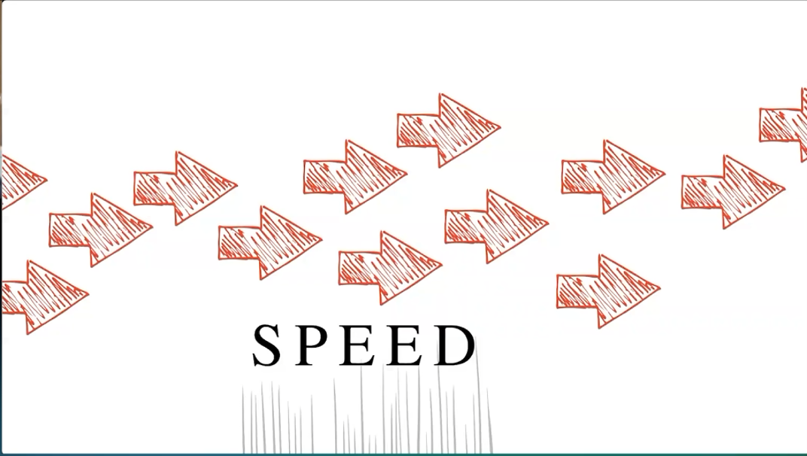
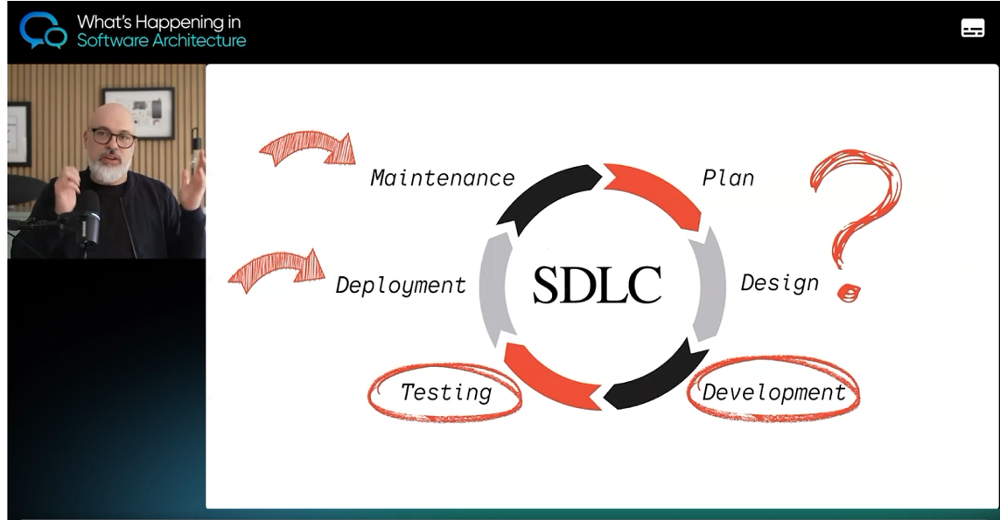
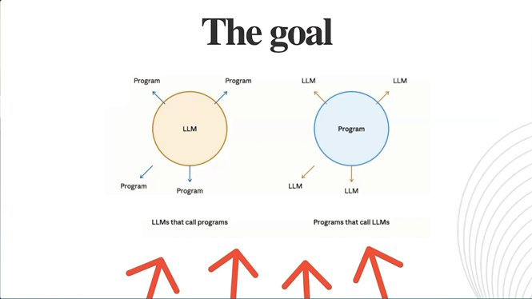
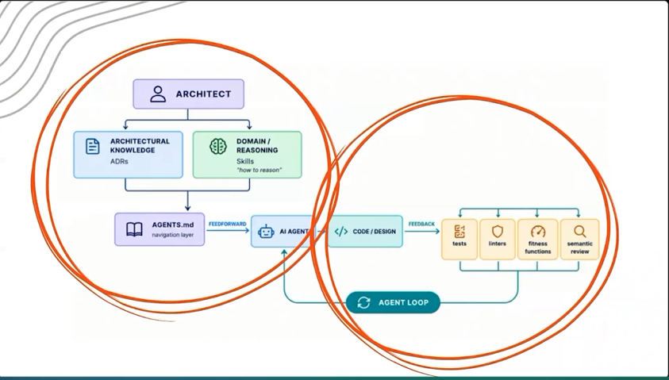
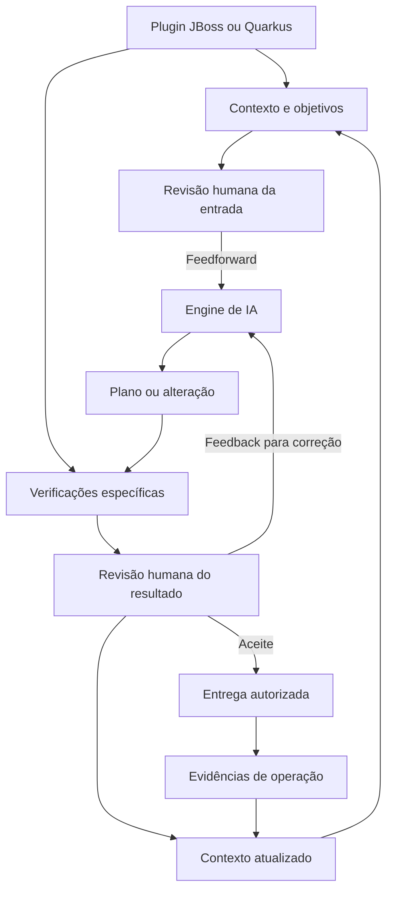

# Visão estratégica e tática do harness para JBoss Quarkus SDLC e modernização

O **JBoss MTA Harness** é um ambiente de trabalho padronizado que construí no VS Code para apoiar a migração das aplicações para JBoss EAP 7.4. Ele reúne ferramentas de análise, scripts de execução, contexto do projeto e evidências de validação, permitindo planejar e realizar correções com apoio de IA e revisão humana. Na prática, o harness organiza como o desenvolvedor utiliza essas ferramentas e acompanha os resultados de cada mudança.

## Objetivo do documento

Orientar a evolução do harness já construído para a migração JBoss em uma base reutilizável para o SDLC e a modernização das aplicações. O documento alinha expectativas sobre IA, distingue capacidades existentes de propostas e define como combinar contexto, ferramentas determinísticas e revisão humana. Deve apoiar decisões de investimento e pilotos, mantendo explícita a responsabilidade por domínio, arquitetura, qualidade e resultado de negócio.

## A engenharia de software na adoção de IA

A adoção de IA no desenvolvimento exige decidir o que acelerar, o que preservar e como verificar os resultados. Essa questão conecta a reflexão de Luca Mezzalira em [What’s Happening in Software Architecture, na O’Reilly, de 22 de setembro de 2026](https://www.oreilly.com/videos/whats-happening-in/0642572416683/) à nossa estratégia: integrar a inteligência ao trabalho de engenharia, mantendo contexto, responsabilidade e controle.

### Velocidade preservando os fundamentos da engenharia

*Figura 1. Speed — captura da apresentação de Luca Mezzalira, O’Reilly.*

A pressão por entregar 10, 20 ou 40 vezes mais coloca a velocidade no centro da discussão. Arquitetura, resiliência e observabilidade continuam essenciais para sustentar essas entregas. Os multiplicadores expressam a expectativa de aceleração; os ganhos efetivos precisam ser demonstrados no nosso ambiente.

Para nós, acelerar deve significar reduzir o tempo até uma mudança útil, verificada e sustentável. A quantidade de código produzido precisa ser avaliada junto com retrabalho, defeitos, esforço de revisão e impacto operacional.

### Planejamento e design continuam parte do trabalho

*Figura 2. SDLC — planejamento e design em discussão, além de desenvolvimento e testes.*

Essa responsabilidade abrange todo o **SDLC, o ciclo de vida de desenvolvimento de software**. Planejamento e design estabelecem o problema a resolver, os limites da solução e os compromissos que orientarão a implementação. A adoção de IA nessas etapas exige preservar a compreensão e a justificativa das decisões.

Nesta estratégia, IA pode apoiar a análise de alternativas, o planejamento e o desenho da solução. Cabe às pessoas confirmar o problema, compreender o domínio, definir prioridades e assumir as decisões e seus efeitos. O harness deve tornar esse contexto acessível e registrar o que foi decidido.

### Acionar a inteligência onde ela agrega valor

*Figura 3. The goal — contraste entre LLMs que acionam programas e programas que acionam LLMs.*

Preservar essa responsabilidade significa manter o controle da lógica e recorrer a agentes nos pontos em que sua contribuição é útil, aproveitando as ferramentas determinísticas existentes. No nosso harness, esse princípio orienta uma escolha arquitetural: explicitar quando um engine participa, quais operações pode executar e como seu resultado será verificado.

MTA, compilação, testes, análises e comandos operacionais continuam com responsabilidades definidas. A IA pode interpretar evidências, propor alternativas e implementar mudanças autorizadas. A autoridade sobre o fluxo e o aceite permanece explícita.

## Harness engineering como fundamento

Tornar esse controle parte do ambiente de trabalho é a função de **harness engineering**: construir e aperfeiçoar os mecanismos que orientam e verificam a atuação de um agente. [Birgitta Böckeler e Chris Ford, na Thoughtworks](https://www.thoughtworks.com/en-br/insights/blog/generative-ai/harness-engineering-agent-feedback-exploring-ai-coding-sensors), descrevem esse suporte e destacam a importância de devolver ao agente informações sobre os resultados.

Em [Harness engineering for coding agent users](https://martinfowler.com/articles/harness-engineering.html), Birgitta diferencia o harness interno da ferramenta daquele que a equipe constrói para seu contexto. Esse ambiente combina orientações antecipadas, ou **feedforward**, com mecanismos de observação e correção, ou **feedback**, distinguindo verificações computacionais de avaliações feitas por IA. As pessoas orientam o trabalho e aperfeiçoam ambos os lados quando surgem problemas recorrentes. Esse ciclo estrutura a colaboração que buscamos estabelecer no harness.

*Figura 4. Conhecimento arquitetural, orientação ao agente e retorno das verificações — captura da apresentação de Luca Mezzalira, O’Reilly.*

### A contribuição da arquitetura para o feedforward

O feedforward começa no entendimento do negócio. Para orientar o agente, precisamos explicitar os subdomínios centrais, de suporte e genéricos, suas responsabilidades e as características arquiteturais necessárias. Essa classificação deve ser revista quando o negócio mudar; ela orienta a análise, sem determinar automaticamente requisitos de segurança, disponibilidade ou desempenho.

Os **Architectural Decision Records, ou ADRs**, registram decisões, alternativas e compromissos assumidos. Instruções como AGENTS.md, ou o formato equivalente do engine, podem referenciar esses registros e traduzir decisões revisadas em orientações aplicáveis. Assim, o agente recebe tanto o objetivo da mudança quanto as razões e restrições que deve considerar.

### Evidências para o feedback e o aprendizado do processo

Após uma alteração, build, testes e análises produzem sinais para a próxima decisão. Na evolução proposta, isso inclui verificações de arquitetura e segurança e informações de execução, como logs, métricas e rastros. A IA pode ajudar a interpretar esses sinais; a evidência original, sua cobertura e suas limitações devem permanecer acessíveis.

A revisão humana avalia também o que os instrumentos não verificam. Problemas recorrentes devem alimentar melhorias nas instruções, nos controles e no contexto, além da correção do código. O aprendizado fica nos artefatos do projeto e do harness.

## Aplicação dessa visão ao harness construído

O JBoss MTA Harness já materializa essa direção ao reunir preparação de contexto, ferramentas de análise e execução, registro das decisões e revisão humana. A evolução proposta amplia essa base para incorporar inteligência com contexto e controle ao longo do desenvolvimento. Os pilotos deverão demonstrar como esse ambiente melhora a execução e a qualidade das decisões.

A estratégia proposta é reaproveitar a arquitetura do **JBoss MTA Harness** em um **harness de engenharia extensível**, inicialmente para JBoss e Quarkus. O núcleo deverá apoiar migrações, o SDLC cotidiano e a modernização. Plugins tecnológicos fornecerão ferramentas e referências; adaptadores permitirão selecionar o engine de IA e integrar a IDE, considerando VS Code hoje e IntelliJ como evolução. O princípio comum é preparar contexto e objetivos antes da atuação da IA e verificar seus resultados antes de aceitar a mudança.

O estado atual abaixo foi conferido no [README do harness](https://github.com/edoardo-bianco/jboss-mta-harness/blob/main/README.md) e no [contrato de migração](https://github.com/edoardo-bianco/jboss-mta-harness/blob/main/doc/especificacoes/planejamento-copilot.md), consultados em 2 de outubro de 2026. A integração JBoss local standalone para EAP 7.1/7.4 está implementada: consulta de estado, start normal ou com debug, deploy com histórico de releases, rollback, stop e attach Java no VS Code. Há testes automatizados e ensaios em bases isoladas; a validação manual completa com a aplicação ainda está pendente. A extração do núcleo comum, os plugins tecnológicos, o suporte Quarkus, a integração IntelliJ e a migração gradual dos scripts para Node.js/TypeScript são propostas de evolução.

## Visão estratégica em três horizontes

| Horizonte | Objetivo | Resultado esperado |
| --- | --- | --- |
| Migrações tecnológicas | Consolidar EAP 7.4 com Java 8 e javax e estender o processo a migrações Quarkus, com versões e restrições próprias | Lotes executados, verificados e aceitos com evidências por perfil |
| SDLC cotidiano | Apoiar requisitos, desenvolvimento, testes, entrega e operação de aplicações JBoss e Quarkus | Continuidade entre demanda, decisão, alteração e resultado |
| Modernização | Apoiar a simplificação do negócio e da arquitetura proposta pelo Fábio, com escolhas tecnológicas explícitas | Mudanças incrementais fundamentadas no conhecimento da aplicação |

O valor pretendido é reduzir perda de contexto e retrabalho, tornar a execução reproduzível e melhorar a qualidade das decisões. Esses benefícios precisam ser medidos. A ampliação do harness deve ocorrer por casos de uso reais, preservando a prioridade da migração.

## Base já construída para a migração

| Capacidade | Situação | Finalidade |
| --- | --- | --- |
| VS Code com tarefas e scripts | Existente | Padronizar a operação do desenvolvedor |
| MTA, build Maven Java 8 e SonarQube | Existente | Analisar a aplicação e produzir verificações técnicas |
| Preparação de contexto e evidências | Existente | Disponibilizar informações pertinentes ao lote |
| Registro da migração, plano e to-do | Existente | Preservar decisões, pendências e progresso |
| DevSquad com GitHub Copilot | Base atual | Apoiar planejamento e implementação |
| Estado, start, deploy/releases, rollback, stop e debug remoto JBoss | Implementado; validação manual completa pendente | Aproximar correção e validação em execução |

O contrato atual separa proposta, GO para implementação, verificações e aceite humano. Preserva o alvo EAP 7.4 e distingue evidência pendente de validação concluída. Sonar e novo MTA integram um checklist não bloqueante; falhas de compilação e testes continuam sendo falhas. Essas regras devem ser conservadas durante a evolução.

As decisões técnicas da migração devem ser confrontadas com o [guia oficial de migração do EAP 7.4](https://docs.redhat.com/en/documentation/red_hat_jboss_enterprise_application_platform/7.4/html-single/migration_guide/index) e com as evidências do ambiente da aplicação.

## Feedforward e feedback loop

No fluxo abaixo, o modelo de feedforward e feedback torna-se um contrato operacional: a entrada é preparada e revisada, a alteração é verificada e os resultados orientam a próxima decisão. O quadro descreve o ciclo desejado; a base JBoss e as integrações propostas são distinguidas nas demais seções.

| Momento | Automação determinística do harness | Revisão humana | Saída |
| --- | --- | --- | --- |
| Feedforward | Coletar relatórios, código, dependências, regras de domínio, ADRs e referências; conferir origem e consistência | Confirmar objetivo, escopo, restrições e critérios de aceite | Contexto revisado para o engine |
| Atuação da IA | Disponibilizar ferramentas autorizadas e registrar ações | Intervir nas decisões previstas pelo contrato | Plano ou alteração verificável |
| Feedback loop | Executar build, testes e análises aplicáveis; incorporar evidências de execução disponíveis | Avaliar correção, impacto e atendimento ao objetivo | Correção orientada, aceite ou interrupção |
| Próximo ciclo | Preservar evidências associadas à versão avaliada | Confirmar decisões que devem permanecer | Contexto atualizado |

A parte determinística está nos procedimentos automatizados e nas verificações reproduzíveis; a revisão humana acrescenta julgamento técnico e de negócio. Uma verificação automatizada comprova apenas os critérios que efetivamente verifica.

O diagrama representa a arquitetura alvo: o plugin tecnológico fornece tanto os elementos do feedforward quanto as verificações do feedback loop. A preparação de contexto e as ferramentas JBoss já formam sua base; a modularização em plugins, o suporte Quarkus, o retorno padronizado entre engines e a integração com a operação são evoluções propostas.

A documentação do [GitHub sobre instruções de repositório](https://docs.github.com/en/copilot/how-tos/copilot-in-your-ide/customize-copilot/configure-custom-instructions/add-repository-instructions-in-your-ide) confirma o uso de orientações sobre projeto, build, testes e validação como contexto. A [documentação de uso responsável dos agentes](https://docs.github.com/en/copilot/responsible-use/agents) recomenda escopo claro, revisão e testes dos resultados. Essas capacidades sustentam o desenho, sem garantir a correção de toda saída.

O feedback deve registrar o esperado, o observado, a evidência e a decisão. Correções permanecem no escopo autorizado; mudanças de objetivo exigem nova decisão. Falta de informação ou ausência de progresso deve permitir interrupção. O conhecimento validado fica nos artefatos do harness, reutilizável com outro engine.

## Evolução para um harness de SDLC

**Proposta arquitetural:** separar o núcleo comum dos plugins tecnológicos, dos adaptadores de engines e dos adaptadores de IDE, seguindo ports and adapters. Uma CLI compartilhada e arquivos de configuração versionados podem atender à implementação inicial. As regras do fluxo e os contratos de contexto devem permanecer no núcleo; cada IDE fornece os comandos e a experiência de uso.

| Componente | Responsabilidade | Exemplos |
| --- | --- | --- |
| Núcleo comum | Organizar objetivo, contexto, estados, autorizações, decisões e evidências | Feedforward, feedback loop, plano e aceite |
| Plugin tecnológico | Integrar ferramentas, regras e documentação da tecnologia | Plugin JBoss e plugin Quarkus |
| Adaptador de engine | Entregar contexto à ferramenta de IA e recolher resultados | DevSquad, GitHub Copilot modernization e AWS Transform custom |
| Adaptador de IDE | Acionar o núcleo, apresentar resultados e integrar execução e debug | Tarefas do VS Code; External Tools e configurações apropriadas do IntelliJ |

Cada trabalho combina **objetivo** — migração, desenvolvimento ou modernização —, **perfil tecnológico** — origem, destino, versões e ferramentas —, **engine** e **IDE**. A política Java 8/javax pertence ao perfil EAP 7.4; o perfil Quarkus deve declarar seus próprios requisitos. A arquitetura separa essas escolhas, mas a compatibilidade operacional de cada combinação precisa ser demonstrada.

## Plugins tecnológicos e formação do contexto

O plugin deve produzir contexto e evidências para o contrato comum e oferecer operações autorizadas para implementar e validar mudanças. A equivalência entre plugins é funcional: cada um cobre as responsabilidades do fluxo usando ferramentas próprias e preservando o significado dos resultados.

| Capacidade | JBoss | Quarkus proposto |
| --- | --- | --- |
| Preparar contexto | MTA, POMs, dependências, configurações e evidências do EAP | POM ou configuração Gradle, BOM, extensões, configurações, versões e guias de migração pertinentes |
| Orientar a mudança | Apontamentos selecionados e regras do perfil EAP | Diferenças entre versões, compatibilidade das extensões e receitas aplicáveis |
| Executar o escopo autorizado | Correções e receitas avaliadas para o lote | Correções e ferramentas de atualização Quarkus avaliadas para o projeto |
| Validar e retroalimentar | Build, testes, Sonar e evidências de execução no EAP | Build, testes da aplicação e do artefato, Sonar e evidências no ambiente de destino |
| Operar o ambiente | Integração JBoss implementada; validação manual completa pendente | Integração proposta com desenvolvimento local, execução, debug e entrega Quarkus |

A documentação oficial da [CLI Quarkus](https://quarkus.io/guides/cli-tooling/) descreve gerenciamento de extensões, build e modo de desenvolvimento. O [guia de testes](https://quarkus.io/guides/getting-started-testing/) documenta testes com Quarkus e a verificação do artefato produzido com `@QuarkusIntegrationTest`. São ferramentas candidatas à integração; o plugin do harness ainda precisa ser implementado.

O [guia de atualização Quarkus](https://quarkus.io/guides/update-quarkus/) descreve automação baseada em OpenRewrite, classificada como experimental e limitada a parte da migração. Recomenda revisar os guias da versão de destino, os diffs, o build e os testes. A execução de comandos de atualização pertence à etapa autorizada de alteração, pois pode modificar o projeto.

Cada plugin deve informar ferramenta e versão, origem da evidência, cobertura e limitações. Os resultados podem compartilhar um formato de contexto sem transformar um relatório Quarkus em um equivalente artificial do MTA. O piloto deve usar ferramentas disponíveis no ambiente corporativo e versões explicitamente escolhidas.

## Portabilidade entre IDEs e evolução dos scripts

**Avaliação de viabilidade:** a documentação oficial fornece mecanismos para essa evolução. O [VS Code permite tarefas do tipo process](https://code.visualstudio.com/docs/debugtest/tasks), e o [IntelliJ permite executar ferramentas externas locais](https://www.jetbrains.com/help/idea/configuring-third-party-tools.html), passando argumentos e caminhos do projeto e exibindo a saída. Com base nessas capacidades, propõe-se uma CLI comum acionada pelas duas IDEs. A integração IntelliJ pode começar chamando os scripts PowerShell existentes em Windows; ela não depende de concluir a mudança de linguagem.

**O que migrar primeiro:** leitura e geração de arquivos, preparação do contexto, organização de evidências e tratamento de resultados são candidatos ao núcleo compartilhado. O Node.js documenta APIs de [sistema de arquivos](https://nodejs.org/api/fs.html) e de [execução de processos](https://nodejs.org/api/child_process.html), que permitem implementar essa automação e orquestrar ferramentas externas. O piloto precisa demonstrar equivalência com o comportamento atual.

**Implementação recomendada:** escrever os módulos em TypeScript, verificar seus tipos e compilar uma CLI JavaScript para execução em Node.js. O [compilador TypeScript](https://www.typescriptlang.org/docs/handbook/2/basic-types.html) oferece essa transformação. Executar TypeScript diretamente no Node não substitui a verificação de tipos, conforme a [documentação do runtime](https://nodejs.org/api/typescript.html). Os dados recebidos de arquivos e ferramentas também precisam de validação em execução. O benefício esperado vem do compartilhamento de módulos e contratos; há o custo adicional de manter build, dependências e distribuição. A versão Node adotada deve estar suportada e aprovada no ambiente corporativo. Ela executa o harness, sem alterar os requisitos Java das aplicações.

**O que manter específico:** chamadas dependentes do sistema operacional devem permanecer em adaptadores, podendo conservar PowerShell quando isso for mais adequado. A documentação de processos do Node registra tratamento próprio para arquivos .bat e .cmd no Windows. Diretório de trabalho, ambiente Java, argumentos, logs, códigos de saída e encerramento de processos precisam ser controlados. Trocar a linguagem não torna automaticamente portáteis as ferramentas que ela executa.

**Integração com a IDE:** comandos, atalhos, visualização de resultados e configurações de debug continuam próprios de cada editor. A execução inicial pode usar External Tools; desenvolver um plugin IntelliJ próprio não é pré-requisito dessa proposta. Para executar e depurar o próprio código Node usando a integração especializada da IDE, a [JetBrains documenta plugins que exigem assinatura Ultimate](https://www.jetbrains.com/help/idea/running-and-debugging-node-js.html). Essa condição é distinta do debug das aplicações Java. Licença, plugins instalados e integrações de IA devem ser conferidos no piloto.

O critério de adoção é preservar o contrato: contexto revisado no feedforward, verificações e revisão humana no feedback loop, rastreabilidade das decisões e continuidade dos artefatos ao mudar de IDE. A redução do esforço de manutenção deve ser demonstrada antes de ampliar a conversão dos scripts.

## Aplicação do núcleo comum ao SDLC

| Etapa do SDLC | Aplicação proposta do mesmo ciclo | Evidência de conclusão |
| --- | --- | --- |
| Requisitos e análise | Reunir demanda, comportamento atual e regras; revisar objetivos | Critérios de aceite acordados |
| Arquitetura e planejamento | Comparar alternativas, avaliar impactos e registrar decisões | Plano com escopo e justificativa |
| Desenvolvimento | Preparar contexto e executar as alterações autorizadas | Diff relacionado à demanda |
| Revisão e testes | Verificar resultados e devolver problemas ao engine | Evidências técnicas e funcionais |
| Entrega | Integrar revisão e esteira existentes | Versão identificada e reversão definida |
| Operação | Incorporar incidentes e comportamento observado | Diagnóstico e contexto para o próximo trabalho |

O harness deve integrar os sistemas existentes de requisitos, Git, CI/CD e operação, preservando os registros oficiais de cada um. Cobrir o SDLC significa conectar suas etapas; não significa conceder execução irrestrita aos agentes.

O [NIST SSDF, SP 800-218](https://csrc.nist.gov/pubs/sp/800/218/final) recomenda incorporar práticas de desenvolvimento seguro às implementações de SDLC. Ele serve de referência para revisar os controles desta evolução. Permissões, proteção de credenciais e evidências de execução precisam ser implementadas nas ferramentas; instruções em linguagem natural não substituem esses controles.

## Engines inteligentes e compatibilidade

“Engine” é a ferramenta que conduz o trabalho. O modelo de linguagem utilizado é uma escolha distinta.

| Engine | O que está fundamentado | Situação no harness |
| --- | --- | --- |
| DevSquad | O contrato do projeto define sua participação no planejamento e na implementação | Base atual |
| GitHub Copilot modernization | A Microsoft documenta avaliação, planejamento, execução e regras de modernização | Adaptador e compatibilidade a avaliar |
| AWS Transform custom | A AWS documenta contexto adicional ao plano, comandos de validação e execução interativa | Integração dependente de piloto |

Fontes: [contrato do harness](https://github.com/edoardo-bianco/jboss-mta-harness/blob/main/doc/especificacoes/planejamento-copilot.md), [repositório oficial Microsoft](https://github.com/microsoft/github-copilot-modernization) e [workflows oficiais AWS](https://docs.aws.amazon.com/transform/latest/userguide/custom-workflows.html).

O adaptador do engine deverá fornecer o contexto e as restrições preparados pelo núcleo e pelo plugin tecnológico, relacionar os artefatos nativos ao plano oficial e devolver feedback verificável. A escolha de JBoss ou Quarkus não determina automaticamente o engine. Executar a CLI do harness em outra IDE também não comprova que extensões, prompts ou agentes funcionarão da mesma forma nela. A integração e a cobertura de cada combinação dependem de validação; as fontes dos fornecedores não comprovam compatibilidade pronta com o contrato do harness.

Para AWS, há condições concretas a testar: os workflows documentam commits de checkpoint, enquanto o contrato atual limita operações Git dos agentes. O [catálogo AWS](https://docs.aws.amazon.com/transform/latest/userguide/transform-aws-customs.html) inclui JBoss para Spring Boot, com destino diferente do nosso. O piloto deve avaliar uma transformação personalizada para EAP 7.4.

A [documentação de instalação AWS](https://docs.aws.amazon.com/transform/latest/userguide/custom-get-started.html) informa suporte nativo a Windows/PowerShell, com exceção dos comandos atx ct, e exige Node.js 22+, Git e acesso ao serviço. A combinação corporativa com PowerShell 5.x ainda precisa ser validada. Execução isolada e devolução de um diff são alternativas propostas para tratar diferenças de comportamento Git.

## Base para a modernização da aplicação

O código atual materializa regras implementadas, integrações e decisões estruturais acumuladas. Por isso, é parte fundamental da base de conhecimento. Para orientar mudanças, esse conhecimento deve ser relacionado à documentação, aos testes, aos contratos, à operação e à validação do negócio.

**Direcionamento proposto para a modernização apresentada pelo Fábio:** compreender um fluxo, confirmar suas regras, identificar o que pode ser simplificado e implementar uma mudança delimitada. O feedforward reúne esse entendimento e o objetivo; o feedback verifica se a mudança produziu o resultado esperado.

A intenção de uma decisão não deve ser inventada a partir do código. Quando desconhecida, deve permanecer como questão a investigar. Testes de caracterização podem registrar o comportamento existente; critérios funcionais próprios devem expressar as mudanças desejadas.

As decisões resultantes atualizam a base do produto. A tecnologia de destino e o desenho arquitetural devem decorrer dessa análise. O harness deverá apoiar tanto a modernização de aplicações JBoss quanto de aplicações Quarkus, selecionando os plugins necessários à origem e ao destino definidos. Uma mudança entre tecnologias constitui um escopo específico, separado da atualização de versões.

## Plano tático e critérios de avanço

A sequência abaixo é proposta, sem calendário ainda acordado. Seu planejamento em fatias pequenas e verificáveis permanece como pendência futura no backlog do harness. Cada fatia deverá explicitar caso de uso, benefício esperado, escopo, dependências, critérios de aceite, evidências e reversão; somente a próxima fatia será detalhada mediante continuidade solicitada. A publicação desta estratégia não inicia essas implementações.

| Etapa | Entrega | Critério de avanço |
| --- | --- | --- |
| Consolidar a migração JBoss | Comprovar um lote completo e concluir a validação da integração JBoss | Outro desenvolvedor reproduz o fluxo e localiza as evidências |
| Extrair o núcleo comum | Definir contratos de feedforward e feedback e separar ferramentas e regras do perfil JBoss | O fluxo atual permanece operacional e as responsabilidades estão delimitadas |
| Pilotar Node.js/TypeScript e IntelliJ | Migrar uma rotina de preparação de contexto para a CLI e acioná-la nas duas IDEs | As mesmas entradas produzem conteúdo e evidências equivalentes, preservando decisões humanas e diferenças previstas, como horários e caminhos locais |
| Ampliar a orquestração portátil | Integrar um comando de build e suas saídas ao núcleo compartilhado | Códigos de saída, falhas, logs, cancelamento e caminhos com espaços são tratados corretamente no ambiente corporativo |
| Pilotar o plugin Quarkus | Preparar contexto e executar uma migração delimitada, com origem e destino definidos | Build, testes e revisão demonstram o resultado e a qualidade do feedback |
| Pilotar um engine alternativo | Adaptador mínimo, com perfil tecnológico e IDE escolhidos | Respeito ao escopo e compatibilidade operacional demonstrados |
| Pilotar o SDLC Quarkus | Conduzir um defeito ou melhoria fora da migração | O mesmo núcleo relaciona demanda, decisão, alteração e validação |
| Conectar entrega e operação | Integrar a esteira e o diagnóstico por tecnologia | Evidências operacionais retornam ao contexto e ao backlog |
| Pilotar a modernização | Escolher um fluxo de negócio e os plugins da tecnologia envolvida | Benefício funcional ou operacional demonstrado |

O primeiro investimento deve ser concluir e comprovar a base atual e explicitar os contratos. A migração dos scripts deve ocorrer por rotina, mantendo os pontos de entrada PowerShell necessários durante a transição. O piloto entre IDEs avalia a portabilidade; o piloto Quarkus, o reaproveitamento entre tecnologias; e o piloto de engine, a substituição da inteligência. São avaliações independentes, que podem avançar separadamente sem condicionar a migração JBoss à nova arquitetura.

**Responsabilidades propostas:** negócio confirma objetivo e regras; arquitetura e tech lead avaliam alternativas e impactos; desenvolvimento implementa e verifica; DevOps integra entrega e operação; o responsável pelo harness mantém o núcleo, os plugins tecnológicos e os adaptadores de engines e IDEs.

**Medição:** registrar a linha de base e acompanhar tempo de preparação e de ciclo, retrabalho, regressões, iterações até o aceite, esforço humano e custo de IA. Comparar trabalhos de escopo semelhante. Na modernização, medir também a simplificação obtida no uso, na manutenção ou na operação. As metas devem ser definidas a partir dos pilotos.
