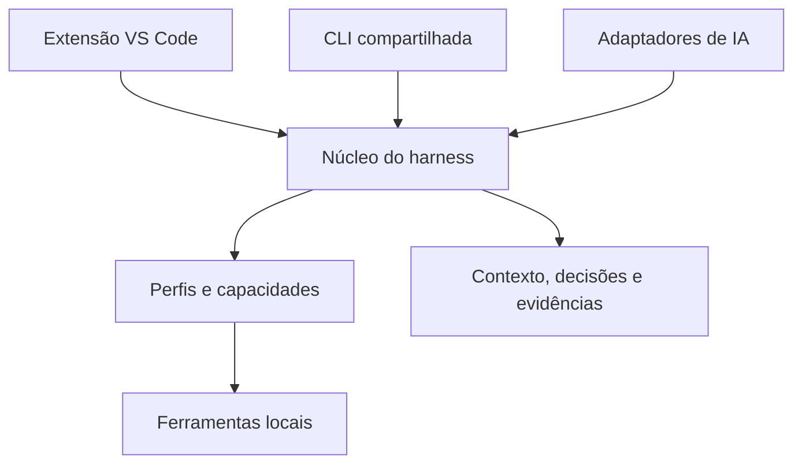

# Especificação de evolução: Engineering Harness como extensão versionada do VS Code

**Versão do documento:** 1.0  
**Data:** 06/10/2026  
**Situação:** proposta de arquitetura e requisitos para planejamento incremental.  
**Projeto-base:** [edoardo-bianco/jboss-mta-harness](https://github.com/edoardo-bianco/jboss-mta-harness).  
**Destino sugerido:** `doc/especificacoes/engineering-harness-vscode.md`.  
**Base consultada:** código e documentação da branch `main` em 06/10/2026.  
**Limite desta especificação:** registra o encaminhamento; não representa extensão implementada, homologação de ferramentas ou aprovação de todas as capacidades futuras.

## 1. Objetivo

Evoluir o harness existente para um produto instalável e versionado, denominado conceitualmente **Engineering Harness**, que acrescente a um workspace do VS Code as capacidades necessárias para conduzir trabalho de engenharia: configuração, ferramentas, tarefas, guias, instruções, agentes, prompts, contexto e evidências.

A experiência desejada é **instalar a extensão, abrir o workspace, configurar o perfil e utilizar o harness**, sem exigir que o desenvolvedor clone seu repositório como pré-requisito de uso.

A extensão será o adaptador de distribuição e experiência do VS Code. Os contratos do fluxo, as capacidades e os registros devem permanecer reutilizáveis por uma CLI e por futuras integrações com outras IDEs e clientes de IA.

O primeiro perfil será o já existente: **migração EAP 7.1 → EAP 7.4, preservando Java 8 e `javax.*`**. Quarkus, novos objetivos do SDLC e modernização continuam evoluções com escopo e validação próprios.

## 2. Encaixe na estratégia e no backlog

Esta especificação complementa os documentos existentes:

- [Estratégia do harness](https://github.com/edoardo-bianco/jboss-mta-harness/blob/main/doc/estrategia/estrategia-harness_.md): núcleo comum, plugins tecnológicos, engines, IDEs, SDLC e modernização.
- [Catálogo de domínios e capacidades](https://github.com/edoardo-bianco/jboss-mta-harness/blob/main/doc/features/evolucao-harness-dominios-capacidades-priorizacao.md): capacidades HAR, SRC, OBJ, DEP, JBS e CHG.
- [Conciliação das evoluções](https://github.com/edoardo-bianco/jboss-mta-harness/blob/main/doc/estrategia/conciliacao-evolucao-harness.md): base reutilizável, lacunas e pendências reais.
- [Contrato de planejamento](https://github.com/edoardo-bianco/jboss-mta-harness/blob/main/doc/especificacoes/planejamento-copilot.md), [AGENTS.md](https://github.com/edoardo-bianco/jboss-mta-harness/blob/main/AGENTS.md) e ADRs vigentes: regras normativas do trabalho.

A distribuição por extensão se relaciona principalmente a:

| Frente | Contribuição desta proposta |
| --- | --- |
| HAR-01 — Catálogo de capacidades | Identificar operações disponíveis e expô-las à interface e aos adaptadores de IA. |
| HAR-02 — Execução local | Acionar ferramentas com projeto, parâmetros, runtimes e destinos explícitos. |
| HAR-03 — Evidências | Preservar recibos, proveniência, contratos e histórico durante atualização. |
| HAR-04 — Separação de escolhas | Distinguir objetivo, perfil tecnológico, engine e IDE. |
| EVO-01 | Materializar a distribuição VS Code e preparar a evolução gradual do núcleo. |

Esta frente não pressupõe implementar todas as 23 capacidades do catálogo. SRC, DEP, JBS e CHG continuam sendo entregas funcionais próprias.

O planejamento de implementação deve permanecer em `tasks/plan.md` e `tasks/todo.md`, conforme a convenção vigente. Esta especificação contém requisitos e critérios de aceite; não deve virar um segundo acompanhamento de execução.

## 3. Resultado esperado para o desenvolvedor

1. Instalar uma versão homologada da extensão.
2. Abrir uma pasta de projeto ou um workspace com vários projetos.
3. Executar a entrada **Harness: configurar workspace**.
4. Selecionar os projetos e o perfil tecnológico.
5. Informar ou confirmar os caminhos das ferramentas já instaladas.
6. Conferir o diagnóstico do ambiente.
7. Utilizar tarefas, guias, contexto, prompts e agentes compatíveis com o cliente escolhido.
8. Retomar trabalho existente com os mesmos registros e evidências.

A instalação ocorre no ambiente de extensões do VS Code; a habilitação funcional e a configuração do harness são controladas por workspace.

O fluxo manual por tarefas continua disponível sem um cliente de IA ativo. O uso de IA não pode ser pré-requisito para configurar o ambiente, executar verificações ou consultar evidências.

## 4. Formato de distribuição

### 4.1. Extensão VS Code como entrega principal

A entrega principal será um arquivo `.vsix`, produzido a partir de uma release do repositório.

| Formato | Função | Decisão proposta |
| --- | --- | --- |
| Extensão VS Code | Comandos, configurações, tarefas, navegação, integração com ferramentas e conteúdo de IA | Distribuição principal. |
| Plugin de agente | Pacote de customizações e integrações suportadas por determinado cliente | Distribuição complementar futura, quando houver benefício comprovado. |
| Extension Pack | Agrupar outras extensões | Opcional para facilitar preparação do ambiente. |

Plugins de agentes já são documentados pelo VS Code, com capacidades que variam conforme o formato e o cliente. Sua existência não substitui a integração operacional necessária ao harness. [R1][R2]

O primeiro VSIX deve incluir os componentes de autoria do projeto: scripts, módulos, perfis, guias, contratos e templates. JDK, Maven, MTA, JBoss e outras ferramentas serão referenciados nas instalações aprovadas, com versões e requisitos verificados.

O nome comercial da extensão pode ser **Engineering Harness** sem renomear imediatamente o repositório `jboss-mta-harness`. Renomeação, identidade do publisher e identificador técnico da extensão são decisões separadas.

### 4.2. Distribuição inicial

O pipeline deverá gerar o VSIX a partir de código revisado, executar as verificações previstas e associar o artefato à versão e ao changelog.

O mecanismo oficial de empacotamento é `vsce package`. O usuário pode instalar pelo comando **Extensions: Install from VSIX**. Exemplo ilustrativo para uma release futura:

```powershell
code --install-extension .\engineering-harness-0.1.0.vsix
```

Publicação no Marketplace será opcional. Extensões instaladas por VSIX têm atualização automática desabilitada por padrão; o processo inicial pode distribuir versões homologadas explicitamente. [R3][R4]

## 5. Arquitetura proposta



O diagrama representa responsabilidades da arquitetura alvo. A implementação inicial pode manter os módulos existentes e introduzir somente os pontos de separação necessários.

| Componente | Responsabilidades | Limite |
| --- | --- | --- |
| Núcleo | Resolver contexto/projeto, preparar solicitações, coordenar operações e registrar resultados | Não importar APIs do VS Code nem depender de um único cliente de IA. |
| Perfis e adaptadores tecnológicos | Declarar restrições, integrar ferramentas e interpretar resultados da tecnologia | Java 8/javax/EAP 7.4 pertence ao perfil EAP. |
| Adaptadores de IA | Entregar contexto e recursos no formato do cliente e recolher resultados aplicáveis | Disponibilidade de recursos não implica autorização de execução. |
| Extensão VS Code | Configuração, comandos, tarefas, seleção, acompanhamento e navegação | Regras do fluxo não devem existir somente em callbacks de interface. |
| CLI compartilhada | Expor operações reutilizáveis fora da interface | A CLI atual deve ser aproveitada; sua evolução não exige um segundo executor. |
| Persistência | Configuração, recibos, planos, decisões e evidências | Dados devem sobreviver à atualização ou remoção da extensão. |

A separação segue **ports and adapters**. A UI e os clientes de IA consomem os mesmos casos de uso e contratos. A implementação inicial pode usar chamadas diretas entre módulos; não exige serviço remoto, barramento interno ou servidor MCP.

Os módulos podem permanecer no mesmo repositório e ser liberados na mesma versão. Divisão em pacotes independentes será justificada por necessidade real de evolução ou distribuição.

## 6. Base existente e adaptação necessária

| Evidência no projeto atual | Adaptação necessária |
| --- | --- |
| `.vscode/tasks.json` chama scripts por `${workspaceFolder}/scripts/...` | Resolver recursos instalados e passar o projeto de destino explicitamente. |
| `Harness.psm1` usa a raiz do harness para configuração e estado | Separar recursos do produto, configuração e dados de execução. |
| Workspace inicial contém a pasta do harness | Descobrir projetos no workspace do usuário sem depender dessa pasta. |
| Configuração em `config/harness.local.json`, com exemplo versionado | Importar configuração existente e oferecer configuração específica do workspace. |
| `.github/agents`, `.github/prompts`, `.github/instructions`, `.codex/agents` e `.agents/skills` | Preparar distribuição e descoberta por adaptadores de cliente. |
| Scripts exigem Windows PowerShell 5.1 | Preservar o requisito na primeira entrega e diagnosticar incompatibilidade. |
| Recibos, `ContractSnapshot` e histórico existentes | Reutilizar identidade e contratos, sem reescrever evidências antigas. |

A primeira extensão será escrita em TypeScript e reutilizará os scripts PowerShell existentes. As primeiras extrações para TypeScript devem atender lacunas concretas, como resolução de caminhos e leitura de configuração, preservando equivalência de comportamento.

O VS Code desktop oferece um host Node.js para extensões. Isso permite empacotar a lógica da extensão sem exigir uma instalação separada de Node.js apenas para essa lógica. A futura CLI externa terá seus requisitos de runtime definidos separadamente. [R5]

Empacotamento não torna automaticamente os scripts atuais compatíveis com Linux, macOS, WSL, SSH ou Dev Containers. O primeiro recorte operacional será **VS Code desktop em Windows com Windows PowerShell 5.1**.

## 7. Recursos, configuração e estado

### 7.1. Contexto explícito de execução

O contrato interno deverá distinguir, conceitualmente:

| Campo proposto | Significado |
| --- | --- |
| `PackageRoot` | Recursos instalados do produto, tratados como imutáveis. |
| `WorkspaceContext` | Identidade do workspace, arquivo quando existente e pastas participantes. |
| `ConfigPath` | Configuração selecionada para aquele workspace. |
| `StateRoot` | Área persistente para dados e histórico do harness. |
| `ProjectRoot` | Fonte local do projeto selecionado para a operação. |

Esses nomes descrevem o contrato proposto; não afirmam que os parâmetros já existem.

Em workspace com várias pastas, nenhuma operação deve assumir silenciosamente que a primeira pasta ou o arquivo ativo é o projeto-alvo. Havendo contexto explícito ou candidato único, usar essa informação; perguntar somente diante de ambiguidade real.

A adaptação deverá revisar os usos de raiz em cada módulo. Apenas substituir um argumento `Root` não comprova a separação, pois ele hoje participa da resolução de recursos e dados.

### 7.2. Propriedade dos dados

| Conteúdo | Destino e regra |
| --- | --- |
| Scripts, guias, perfis, contratos e templates comuns | Dentro do VSIX; substituídos como parte da release. |
| Configuração compartilhável | Arquivo do workspace/projeto, versionável conforme decisão da equipe. |
| Caminhos e ajustes da máquina | Configuração local separada, sem obrigar seu versionamento. |
| Credenciais | Mecanismo seguro do cliente/ambiente; sem gravar segredos nos templates ou recibos. |
| Planos, registros, recibos e evidências | Área persistente configurada, preservando as convenções existentes. |
| Cache descartável | Área identificada como cache; não conter a única cópia de decisões ou evidências. |

O nome e a localização exatos de novos arquivos de configuração serão definidos no primeiro incremento. Não mover nem renomear dados existentes automaticamente.

A adoção de um workspace já usado pelo harness deverá reconhecer a configuração e o estado existentes. Quando for necessária migração, produzir mapeamento explícito, conferir referências e preservar a origem.

A área `.harness` continua local; não passa a representar lock compartilhado, sincronização entre colegas ou coordenação de branches.

## 8. Integração com VS Code e clientes de IA

### 8.1. Experiência operacional

A extensão deverá oferecer:

- Configuração inicial e diagnóstico de pré-requisitos.
- Seleção de projeto/perfil sem repetir informações já disponíveis.
- Run Tasks com os prefixos atuais: `Workspace:`, `Aplicacao:`, `Servidor:`, `MTA:` e `Planejamento:`.
- Acesso aos guias, registros, planos e evidências.
- Saída de execução, estado, falhas e cancelamento conforme a operação.
- Consulta à versão instalada e à composição utilizada pelo workspace.

Um `TaskProvider` pode fornecer tarefas dinamicamente, reduzindo a necessidade de distribuir cópias completas de `tasks.json`. Arquivos existentes de tarefas, configurações e debug devem ser preservados. [R6]

Uma visão lateral pode facilitar a navegação, mas não é pré-requisito para o primeiro piloto. Comandos, tarefas e abertura de documentos são suficientes para demonstrar o fluxo.

### 8.2. Agentes, prompts, instruções e skills

O VS Code documenta contribuições de extensão para `chatAgents`, `chatPromptFiles`, `chatInstructions` e `chatSkills`. A utilização deverá ser verificada na versão de VS Code/Copilot homologada para o piloto. [R7]

Regras da distribuição:

1. Manter conteúdo comum com uma origem controlada e gerar/adaptar os recursos específicos dos clientes.
2. Preservar diferenças de formato, descoberta e permissões entre Copilot e Codex.
3. Habilitar os recursos de acordo com o workspace e o perfil; evitar aplicar regras EAP em projetos com outro objetivo.
4. Se houver materialização de arquivos, registrar sua origem e preservar personalizações.
5. Evitar disponibilizar simultaneamente cópias equivalentes por extensão e plugin de agente.
6. Conferir descoberta, leitura de contexto e continuidade em ensaios reais dos clientes.

A presença dos arquivos não comprova integração nativa. A validação deverá verificar o que o cliente efetivamente descobre e utiliza.

Ferramentas de IA via API do VS Code ou MCP poderão ser acrescentadas quando necessárias. Devem chamar operações do mesmo núcleo, com entradas estruturadas, projeto explícito e resultados verificáveis. MCP não é requisito para o primeiro VSIX. [R8]

### 8.3. Execução local

Operações demoradas devem executar fora do fluxo síncrono da interface, com saída acessível e tratamento de falhas. O contrato de cada operação deverá especificar parâmetros, diretório de trabalho, runtime, timeout aplicável, cancelamento e artefatos produzidos.

Cancelar uma tarefa deverá tratar os processos pertencentes àquela execução, evitando encerrar indiscriminadamente processos Java ou servidores de outras atividades.

O contexto deve deixar explícito onde a ferramenta será executada. Suporte remoto exigirá piloto próprio; caminhos Windows locais não devem ser reutilizados como se apontassem ao ambiente remoto.

O produto deverá respeitar Workspace Trust para operações que executam código ou ferramentas. A confiança no workspace não substitui o GO do lote previsto no contrato. [R9]

## 9. Versionamento, compatibilidade e atualização

### 9.1. Identidades a registrar

| Elemento | Controle |
| --- | --- |
| Extensão e componentes distribuídos juntos | Versão SemVer da release e referência do código de origem. |
| Perfil tecnológico | Identificador e revisão/versão do perfil. |
| Configuração e registros estruturados | Versão de esquema e compatibilidade declarada. |
| Contrato/template da solicitação | Snapshot ou hash, conforme o mecanismo existente. |
| Ferramentas externas | Versões observadas na execução. |
| Artefatos materializados | Caminho, origem e referência do conteúdo inicialmente gerado. |

O manifesto da extensão declara `version` e a faixa de compatibilidade `engines.vscode`. A versão mínima será escolhida após verificar as APIs necessárias e o ambiente corporativo. [R2]

No primeiro produto, extensão, runtime e conteúdo comum podem ter uma única release coordenada. Versões independentes e instalação paralela de runtimes são evoluções, não requisitos iniciais.

### 9.2. Regras de atualização

- Atualizar a extensão não deve reescrever recibos, snapshots ou decisões históricas.
- Uma solicitação em andamento continua vinculada ao contrato registrado.
- A adoção de um novo contrato segue o mecanismo vigente de nova solicitação/sucessão quando aplicável.
- Migrações de esquema devem ser explícitas, verificáveis e preservar recuperação apropriada.
- Uma versão incompatível deve explicar o problema e preservar os dados.
- Reinstalar um VSIX anterior não comprova que dados migrados voltaram a ser compatíveis.

Para arquivos gerados e editáveis, comparar **conteúdo originalmente instalado**, **conteúdo local atual** e **conteúdo da nova versão**. Atualizações sem divergência podem ser aplicadas pelo comando de atualização; conflitos devem ser apresentados para decisão.

Aplicar a configuração novamente com as mesmas entradas deve ser idempotente: sem duplicar tarefas, agentes, prompts ou referências.

Um futuro arquivo como `harness.lock.json` poderá registrar a composição homologada. Ele só terá efeito se houver um mecanismo que o interprete; sua presença não fixa automaticamente a versão da extensão instalada.

## 10. Contratos existentes a preservar

A distribuição como extensão deve preservar:

- Separação entre evolução do harness e corretivas das aplicações.
- Planejamento a partir do registro, com `PlanningBasis=MTA|EVIDENCIAS`.
- Identidade e vínculos de `Project`, `Source`, `RequestId`, `RunId` quando existente, `Previous` e destinos explícitos.
- `MtaOrigin` e `AnalysisSource` distintos do fonte local quando aplicável.
- Proposta, GO, execução autorizada, verificações e aceite humano como momentos distintos.
- Helpers com seu papel atual de leitura/orientação.
- Git informativo, sem reintroduzir gates por branch, HEAD ou árvore de trabalho.
- Java 8/javax/EAP 7.4 no perfil atual.
- Sonar e nova rodada MTA conforme o checklist vigente, sem converter ausência de comparação em resolução comprovada.

Preparar contexto, disponibilizar uma ferramenta ou instalar a extensão não autoriza corretivas. Habilitar futuros executores permanece uma entrega própria, respeitando as dependências VAL-01 e SDLC-04/05 registradas na conciliação.

## 11. Escopo inicial e limites

**Incluído no primeiro produto utilizável:**

- Instalação por VSIX.
- Windows/PowerShell 5.1 e perfil EAP existente.
- Configuração por workspace e seleção de projetos.
- Reutilização das operações existentes.
- Recursos de orientação e documentação associados à release.
- Acesso ao histórico e continuidade de trabalho.
- Caminho de atualização que preserve configuração e dados.

**Evoluções posteriores, com recortes próprios:**

- Extração mais ampla para TypeScript.
- Novos perfis, incluindo Quarkus.
- IntelliJ, outras plataformas e ambientes remotos.
- Novos adaptadores de IA, MCP e plugin de agente independente.
- Capacidades SRC, DEP, JBS e CHG ainda não implementadas.
- Runtimes com versões simultâneas por workspace.
- Publicação no Marketplace e distribuição corporativa ampliada.

A primeira entrega não deve depender de reescrita integral, instalação automática de ferramentas externas, serviço central ou conclusão de todo o catálogo de capacidades.

## 12. Sequência proposta de implementação

| Incremento | Entrega | Critério de saída |
| --- | --- | --- |
| 1 — Separar recursos e dados | Contexto explícito, resolução de caminhos e compatibilidade com configuração existente | Fluxo atual funciona sem gravar na instalação do produto. |
| 2 — Empacotar a operação | VSIX, configuração, diagnóstico e tarefas | Workspace de aplicação utiliza o harness sem clone do seu repositório. |
| 3 — Distribuir conhecimento | Guias, contratos, prompts, agentes e skills por cliente | Recursos são descobertos e utilizados nos clientes escolhidos. |
| 4 — Validar atualização | Compatibilidade, preservação de histórico e tratamento de arquivos gerados | Atualização mantém personalizações e permite retomar solicitações. |
| 5 — Ampliar o núcleo | Contratos reutilizáveis e primeiro novo perfil/consumidor selecionado | Nova integração reutiliza o fluxo sem duplicar regras centrais. |

Esta sequência organiza dependências; não estabelece prazo aprovado. Cada incremento deverá indicar o que será reutilizado, a lacuna concreta e a validação necessária.

Ao iniciar desenvolvimento, seguir a branch `harness/<objetivo>` e o fluxo de revisão do repositório. O nome da branch não é requisito de uso do produto pelos projetos consumidores.

## 13. Critérios de aceite e piloto

O piloto utilizará ferramentas aprovadas e uma aplicação externa ao repositório do harness. Deve demonstrar:

| ID | Cenário | Resultado verificável |
| --- | --- | --- |
| AC-01 | Instalar o VSIX e abrir a aplicação | Não depender do clone do harness. |
| AC-02 | Configurar workspace simples e com várias pastas | Resolver o projeto correto e pedir escolha somente quando necessário. |
| AC-03 | Diagnosticar pré-requisitos | Informar ferramentas disponíveis, ausentes e incompatíveis sem modificar instalações. |
| AC-04 | Executar operação existente | Preservar comportamento, parâmetros, saídas e evidências esperadas. |
| AC-05 | Preparar planejamento e continuar um lote | Preservar registro, identidade, contrato, GO e aceite. |
| AC-06 | Utilizar Copilot e Codex nos recortes homologados | Comprovar descoberta dos recursos e acesso ao contexto; registrar limitações. |
| AC-07 | Adotar workspace já configurado | Preservar dados e referências, sem duplicação ou renomeação silenciosa. |
| AC-08 | Atualizar o VSIX durante trabalho pendente | Manter configuração, histórico e contrato da solicitação. |
| AC-09 | Atualizar arquivo gerado personalizado | Apresentar divergência e preservar conteúdo do usuário. |
| AC-10 | Falha, timeout ou cancelamento | Registrar o resultado e não deixar estado falsamente concluído. |
| AC-11 | Operar em workspace sem confiança | Respeitar as restrições do VS Code nas ações que executam ferramentas. |
| AC-12 | Remover a extensão | Manter planos, decisões, configuração e evidências. |

**Marco de aceitação do produto:** instalar o VSIX, configurar o workspace da aplicação, completar um lote do fluxo EAP existente e demonstrar continuidade após atualização da extensão, sem perda de configuração, personalizações ou evidências.

Testes automatizados devem cobrir contratos, resolução de caminhos, idempotência e compatibilidade de dados. Ensaios no VS Code e nos clientes de IA comprovam descoberta e comportamento operacional; testes simulados não substituem esses ensaios.

## 14. Decisões ainda necessárias

| Decisão | Momento de definição |
| --- | --- |
| Identificador da extensão e publisher | Antes da primeira distribuição. |
| Versões mínimas homologadas de VS Code e clientes de IA | No planejamento do primeiro piloto. |
| Localização e esquema da configuração por workspace | No incremento de separação de recursos e dados. |
| Adoção do estado atual e regra de recuperação | Antes de utilizar dados reais existentes. |
| Operações e clientes que compõem o primeiro piloto | Ao recortar a primeira entrega utilizável. |
| Política de suporte entre versões | Antes de distribuir a primeira atualização. |
| Canal de distribuição e eventual Marketplace | Após validar o VSIX no ambiente escolhido. |

Essas decisões não impedem registrar o encaminhamento nem exigem escolher antecipadamente todas as futuras tecnologias.

## 15. Integração desta especificação ao repositório

1. Adicionar o documento em `doc/especificacoes/engineering-harness-vscode.md`.
2. Referenciá-lo na estratégia como especificação da distribuição VS Code.
3. Relacioná-lo na conciliação a HAR-01..04 e EVO-01, preservando as demais pendências.
4. Quando houver recorte de implementação, registrá-lo em `tasks/plan.md` e `tasks/todo.md`.
5. Atualizar o README quando existir uma entrega utilizável, distinguindo proposta de funcionalidade disponível.

A incorporação do documento não deve marcar o catálogo, os pilotos ou as validações pendentes como concluídos.

## 16. Referências oficiais

Fontes de plataforma consultadas em 06/10/2026. Confirmar sua aplicabilidade às versões escolhidas antes de implementar.

| Referência | Uso nesta especificação |
| --- | --- |
| [R1 — Agent plugins in VS Code](https://code.visualstudio.com/docs/agent-customization/agent-plugins) | Formato complementar para customizações de agentes. |
| [R2 — Extension Manifest](https://code.visualstudio.com/api/references/extension-manifest) | Identidade, SemVer, compatibilidade, dependências e Extension Packs. |
| [R3 — Publishing Extensions](https://code.visualstudio.com/api/working-with-extensions/publishing-extension) | Empacotamento VSIX e distribuição. |
| [R4 — Extension Marketplace](https://code.visualstudio.com/docs/configure/extensions/extension-marketplace) | Instalação por VSIX e comportamento de atualização. |
| [R5 — Extension Host](https://code.visualstudio.com/api/advanced-topics/extension-host) | Runtime e localização de execução das extensões. |
| [R6 — Task Provider](https://code.visualstudio.com/api/extension-guides/task-provider) | Disponibilização dinâmica de tarefas. |
| [R7 — Contribution Points](https://code.visualstudio.com/api/references/contribution-points) | Agentes, instruções, prompts, skills e demais contribuições. |
| [R8 — AI extensibility](https://code.visualstudio.com/api/extension-guides/ai/ai-extensibility-overview) | Opções de integração com ferramentas de IA e MCP. |
| [R9 — Workspace Trust](https://code.visualstudio.com/api/extension-guides/workspace-trust) | Restrições de execução em workspaces não confiáveis. |

As fontes demonstram mecanismos da plataforma. A arquitetura, os requisitos e a sequência de incrementos deste documento são uma proposta aplicada ao harness existente.

