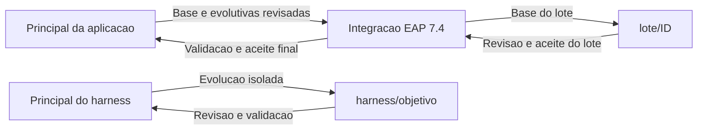

---
html:
  embed_local_images: true
  embed_svg: true
  offline: true
---

# Git: branches, integracao e diagnostico

<a id="diagnostico-de-branches-com-git-e-tortoisegit"></a>

[Voltar ao fluxo principal](harness-migracao-desenvolvedor.md#roteiro-onde-estou-e-o-que-escolho).

Este guia reune organizacao das branches, integracao e comparacao de conteudo
com Git/TortoiseGit. Use-o ao escolher a base da
[implementacao](harness-migracao-desenvolvedor.md#6-implementar-o-lote-autorizado)
ou ao revisar e integrar o
[resultado aceito](harness-migracao-desenvolvedor.md#7-verificar-e-aceitar-o-resultado).
Os comandos Git partem da **raiz do repositorio da aplicacao**; ao evoluir o
harness, use o repositorio do harness. A equipe controla essas operacoes.

Navegacao: [branches](#branches-e-conferencia-git) ·
[origem/destino](#matriz-de-origem-e-destino-por-fase) ·
[comparacao](#escolher-a-direcao-da-comparacao) ·
[TortoiseGit](#investigar-visualmente-no-tortoisegit) ·
[registro da revisao](#registro-minimo-da-revisao).

## Branches e conferencia Git

**A equipe controla branches e integracoes.** O harness nao cadastra papeis Git,
nao bloqueia planejamento por branch/HEAD e nao faz merge ou push automaticamente.
MTA/build registram Git como referencia; novos contextos de planejamento usam a
origem MTA e o projeto local, sem coletar Git. A [ADR-0004](../adr/0004-git-informativo-sem-controle-de-branches.md)
substitui os controles antigos da ADR-0003.

### Estrutura de branches ao longo da migracao

Este e o fluxo de organizacao adotado no ensaio, adaptavel aos nomes e politicas
da equipe. Os nomes nao sao requisitos do planejamento. `main` pode se chamar
`develop`; a integracao pode ser `develop_jboss_eap74`. Principal nao significa
deploy automatico em producao.

| Branch | Papel e origem | Quando recebe alteracoes |
| --- | --- | --- |
| `main` (ou `develop`) da aplicacao | Linha principal; pode continuar recebendo evolutivas durante a migracao. | Recebe a migracao apos validacao e aceite final, pelo fluxo de revisao da equipe. |
| `main_jboss_eap74` | Integracao da migracao, criada a partir da principal da aplicacao. | Acumula lotes aceitos e atualizacoes pertinentes da principal; o estado integrado precisa ser revalidado. |
| `lote/<ID-do-lote>` | Corretiva de um unico lote; no fluxo recomendado, nasce da integracao EAP 7.4 atualizada. | Recebe implementacao/testes com GO; depois de revisao e aceite, integra na EAP 7.4. |
| `harness/<objetivo>` | Evolucao de scripts, prompts, tasks e documentacao; nasce da principal do repositorio do harness. | Recebe somente a evolucao do harness; depois de revisao/validacao, integra na principal do harness. |

### Matriz de origem e destino por fase

**ORIGEM fornece o codigo; DESTINO recebe as alteracoes.** Na criacao de branch,
ORIGEM e a base inicial; nas integracoes, e a branch cujas alteracoes serao
revisadas e incorporadas. Os exemplos abaixo sao do repositorio da aplicacao.

| Fase | ORIGEM | DESTINO | Acao e ponto de conferencia |
| --- | --- | --- | --- |
| 1. Abrir a frente de migracao | `main` | Nova `main_jboss_eap74` | Criar a integracao a partir da principal escolhida e identificar a base analisada pelo MTA. |
| 2. Iniciar a corretiva de um lote | `main_jboss_eap74` atualizada | Nova `lote/<ID>` | Criar a branch de trabalho sobre a base pretendida; implementar somente o lote com GO. A Run Task parte do HEAD atual, sem atualizar a base automaticamente. |
| 3. Incorporar evolutivas durante a migracao | `main` | `main_jboss_eap74` | Comparar evolutivas, revisar impactos, integrar e revalidar o codigo resultante. As corretivas de migracao ja presentes no destino devem ser preservadas. |
| 4. Atualizar um lote ainda em andamento, quando necessario | `main_jboss_eap74` | `lote/<ID>` | Incorporar mudancas pertinentes da integracao, resolver sobreposicoes e conferir se plano, corretiva e testes continuam aplicaveis. A equipe coordena essa operacao. |
| 5. Integrar o lote aceito | `lote/<ID>` | `main_jboss_eap74` | Revisar o diff contra o escopo aprovado, integrar pelo fluxo da equipe e revalidar o estado integrado. Novo MTA e reconciliacao orientam o proximo lote solicitado. |
| 6. Entregar a migracao concluida | `main_jboss_eap74` | `main` | Apos validacao e aceite final, revisar o conjunto migrado, integrar e validar o commit resultante. Publicacao/deploy do artefato seguem autorizacao propria. |

O percurso normal da corretiva e **integracao EAP 7.4 -> lote -> integracao EAP 7.4**.
Enquanto isso, evolutivas seguem **principal -> integracao EAP 7.4**. O retorno
**integracao EAP 7.4 -> principal** e a entrega final da migracao, depois do aceite;
nao acontece a cada push de lote. Repita o ciclo dos lotes sobre a base integrada,
sem planejar antecipadamente todas as corretivas.

Antes de integrar, confirme repositorio e referencias concretas. `origin/main`
e `origin/main_jboss_eap74` representam o ultimo estado remoto obtido por fetch;
as branches locais podem conter trabalho ainda nao publicado. A secao
[de comparacao de branches](#escolher-a-direcao-da-comparacao)
detalha os comandos e as diferencas entre comparar historico e conteudo. A matriz
aqui explica a estrategia; nenhuma dessas operacoes e automatizada pelo planejamento.



**Antes do primeiro lote:** a equipe prepara a integracao EAP 7.4 a partir da
principal e analisa esse codigo, ou reutiliza um MTA pertinente conferindo os
pontos locais. Planejar nao exige criar branch de lote nem autoriza editar codigo.

**Ao implementar:** registre GO e selecione a base pretendida antes de executar
**Aplicacao: preparar implementacao do lote**. A opcao 1 cria `lote/<ID>` a partir
**do HEAD atual exibido**, e nao procura nem atualiza `main_jboss_eap74` sozinha.
A opcao 2 mantem a branch atual; a 3 cria um nome informado. Confira a base e o
checkout: o nome da branch nao garante que contenha as ultimas integracoes.

**Ao concluir um lote:** confira diff, verificacoes e pendencias, obtenha aceite e
integre pelo processo da equipe. Push publica a branch; **nao integra** as mudancas
na principal nem na EAP 7.4. Depois da integracao, revalide o codigo resultante;
para planejar o proximo lote, reconcilie o historico e evidencias dessa base;
se nao houver novo MTA, mantenha a comparacao pendente.
A branch do lote pode permanecer publicada como historico; o harness nao a apaga.
Registre tambem o commit integrado e as evidencias da verificacao.

**Durante a migracao:** avalie novas evolutivas da principal e integre as pertinentes
na EAP 7.4, resolvendo sobreposicoes e revalidando os lotes afetados. Frentes
simultaneas usam branches/checkouts separados; `.harness` local nao coordena
desenvolvedores e nao e lock compartilhado.

**Ao finalizar:** reconcilie a cobertura, resultados e pendencias, obtenha aceite
final e integre EAP 7.4 na principal pelo fluxo aprovado. Identifique o commit e
o artefato validado. Publicar ou integrar nao autoriza deploy: a promocao para o
servidor segue uma decisao e rotina proprias da equipe.

### Branch exclusiva para alterar o harness

Use `harness/<objetivo>` derivada da principal, com `tasks/plan.md` e `tasks/todo.md`.
Revise/valide antes de integrar. Com migracao em andamento, use worktree/checkout
separado; nao troque a branch usada por outro agente.

**No ensaio deste repositorio**, harness e exemplos compartilham a raiz Git:
trocar a branch afeta ambos. Apos integrar uma evolucao do harness na principal,
leve-a explicitamente para `main_jboss_eap74`, conferindo conflitos e impactos nas
evidencias. Isso nao incorpora automaticamente branches de lote. Um commit
publicado apenas em `lote/HIB-CACHE-001` ainda precisa de integracao para aparecer
nas branches principais.

**Na empresa, com repositorios separados**, atualizar o harness nao altera branches
da aplicacao. Cada repositorio tem sua principal e seu fluxo; o workspace apenas
os apresenta juntos. Nunca use a branch do harness para identificar o codigo de
outro projeto. Planos de corretivas ficam nos destinos do contexto, fora de `tasks/`.

### Historico e transicao

Trocar branch/HEAD nao exige novo contexto nem MTA por si so. Confira fontes,
POMs e configuracoes relevantes. Se mudaram, registre alerta, avalie aplicabilidade
e recomende novo MTA; nao atribua o commit atual a uma analise antiga.
GO e aceite humano continuam separados.

`gitPolicies` antigas sao ignoradas. A tarefa de conferir Git foi removida e nao
e pendencia a renovar. Recibos/planos antigos permanecem historicos; ao revisar,
substitua somente exigencias superadas, preservando pendencias tecnicas reais.
Os comandos de comparacao e diagnostico visual estao nas secoes seguintes.

O diagnostico a seguir foi adaptado do guia
`guia_diagnostico_diferencas_develop_feature_tortoisegit.md`, fornecido pelo
desenvolvedor em 2026-09-27. O original permanece no local de origem.
Comparar branches nao autoriza merge nem deploy.

## Escolher a direcao da comparacao

Use **DESTINO** para a branch que recebera alteracoes e **ORIGEM** para a que as
fornece. Os exemplos usam `main`; na equipe, substitua por `develop` e
`develop_jboss_eap74` quando esses forem os nomes acordados.

| Momento | DESTINO | ORIGEM | O que revisar |
| --- | --- | --- | --- |
| Trazer evolutivas para a migracao | `origin/main_jboss_eap74` | `origin/main` | Novidades da principal e impacto nas corretivas ja integradas. |
| Integrar um lote aprovado | `origin/main_jboss_eap74` | `origin/lote/cache-hib-001` | Somente o escopo aprovado e suas dependencias/testes. |
| Entregar a migracao validada | `origin/main` | `origin/main_jboss_eap74` | Conjunto final de corretivas, alinhamento com evolutivas e evidencias da release. |

A branch do lote e um exemplo: ela so existe depois de definida a proposta e
criada pelo desenvolvedor. Use referencia local para trabalho ainda nao publicado
e registre essa escolha; `origin/...` representa apenas o estado obtido no ultimo
fetch. Nao compare um projeto usando as branches do repositorio do harness.

## Preparar o diagnostico

Na raiz Git da aplicacao, confira o checkout e atualize as referencias remotas:

```powershell
git status --short --branch
git fetch origin --tags
```

Preserve alteracoes locais. Fetch atualiza referencias/objetos e nao integra
automaticamente a branch atual. Se falhar, nao considere os dados remotos atuais.
Veja a [documentacao de fetch](https://git-scm.com/docs/git-fetch).

No PowerShell, selecione **um par** da tabela. Exemplo: trazer a principal para EAP 7.4.

```powershell
$branchDestino = 'origin/main_jboss_eap74'
$branchOrigem = 'origin/main'
git rev-parse --show-toplevel
git rev-parse $branchDestino
git rev-parse $branchOrigem
```

Registre repositorio, referencias, os dois hashes e data da consulta na revisao
do lote/PR. Se uma referencia nao existir, esclareca o nome/publicacao antes de
prosseguir. Nao crie branches apenas para conseguir executar uma comparacao.

## Comparar conteudo e historico

Execute com o par escolhido:

```powershell
git diff --name-status "${branchDestino}...${branchOrigem}"
git diff --stat "${branchDestino}...${branchOrigem}"
git diff "${branchDestino}...${branchOrigem}"
git log --oneline "${branchDestino}..${branchOrigem}"
git diff --name-status $branchDestino $branchOrigem
git log --left-right --graph --oneline "${branchDestino}...${branchOrigem}"
```

| Comparacao | Interpretacao |
| --- | --- |
| `git diff DESTINO...ORIGEM` | Mudancas da origem desde o ancestral comum. A ordem importa. |
| `git diff DESTINO ORIGEM` | Diferencas entre os dois conteudos atuais. Equivale a `git diff DESTINO..ORIGEM`. |
| `git log DESTINO..ORIGEM` | Commits alcancaveis na origem e ausentes do historico do destino. |
| `git log --left-right DESTINO...ORIGEM` | Commits exclusivos: `<` no destino, `>` na origem. |

Os tres pontos possuem significados diferentes em diff e log. O diff desde o
ancestral comum ajuda a revisar a proposta; nao simula o resultado do merge nem
garante ausencia de conflitos. Confira [git diff](https://git-scm.com/docs/git-diff)
e [git log](https://git-scm.com/docs/git-log).

Na lista de arquivos, `M` indica modificacao, `A` adicao, `D` exclusao e `R`
renomeacao detectada. Revise especialmente POMs, versoes, configuracoes e arquivos
compartilhados entre lotes. Diff direto vazio significa conteudo igual nos dois
snapshots; nao comprova igualdade de historico, testes aprovados ou aceite.

Depois da integracao, um diff direto ainda pode mostrar diferencas porque o
destino recebeu outras alteracoes. Com squash/cherry-pick, commits podem continuar
aparecendo como exclusivos apesar de suas mudancas terem sido incorporadas.
Investigue conteudo e historico juntos; nao reaplique uma corretiva apenas pela
contagem de commits nem exija que a migracao fique identica a principal enquanto
ainda contem corretivas pendentes de entrega.

## Investigar visualmente no TortoiseGit

1. No repositorio da aplicacao, abra **TortoiseGit > Browse References**.
2. Selecione as duas referencias do par escolhido, por exemplo
   `refs/remotes/origin/main_jboss_eap74` e `refs/remotes/origin/main`.
3. Use a comparacao das duas referencias e confira quais revisoes ocupam cada
   lado. Essa comparacao direta mostra os estados finais; nao presuma que equivale
   ao diff de tres pontos desde o ancestral comum.
4. Abra os arquivos relevantes para comparacao linha a linha. A ferramenta pode
   ser TortoiseGitMerge ou outra configurada pelo desenvolvedor.
5. Use **Show Log** para autores, commits e arquivos. Selecione duas revisoes e
   use **Compare revisions** para comparar seus conteudos.
6. Use **Revision Graph** para entender divergencias e integracoes. O grafo ajuda
   a explicar o historico; o diff confirma o conteudo efetivo.

Referencias: [Browse All Refs](https://tortoisegit.org/docs/tortoisegit/tgit-dug-browse-ref.html)
e [Viewing Differences](https://tortoisegit.org/docs/tortoisegit/tgit-dug-diff.html).
Os nomes dos menus podem variar com idioma e versao instalada.

## Aplicar o diagnostico nos tres momentos do fluxo

**Principal para EAP 7.4:** revise as evolutivas, coordene impactos e integre pelo
fluxo aprovado da equipe. No checkout atualizado da migracao, execute build e
testes e reconcilie os lotes afetados antes de retoma-los. Recomenda-se nova rodada
MTA para conferir o diagnostico da base integrada; sem ela, registre a comparacao
como pendente, sem transformar essa ausencia em bloqueio automatico.

**Lote para EAP 7.4:** confira o diff contra o escopo aprovado, evidencias e revisao
humana. Depois de integrar, revalide o commit resultante conforme os criterios
do lote. Novo MTA e checklist nao bloqueante: se executado, confira sua
comparabilidade; se ausente, preserve a pendencia. Relatorios de commits
individuais nao comprovam o estado integrado. O proximo lote parte dessa base,
apos aceite, reconciliacao das evidencias disponiveis e pedido de continuidade.

**EAP 7.4 para principal e producao:** conclua a cobertura e obtenha aceite humano
final da migracao, com rodada final comparavel e verificacoes do escopo sem
pendencias. Antes do PR final, confira novas evolutivas da principal e
revalide sua incorporacao na migracao. Revise e integre conforme a politica da
equipe; valide o commit resultante na principal. Identifique release/tag e artefato
aprovados, ambiente EAP 7.4 de destino e procedimento de rollback antes da
autorizacao de implantacao. Merge nao significa deploy: promover o artefato e
uma etapa separada. Este harness ainda nao automatiza release/deploy em PRD.

Para comparar uma release identificada, use uma tag existente como ORIGEM:

```powershell
git diff --name-status origin/main v1.2.0
```

`v1.2.0` e ilustrativa. Registre a tag/commit e a identidade do artefato realmente
testado; igualdade de codigo por si so nao comprova equivalencia do binario.

## Registro minimo da revisao

- Projeto/repositorio, modulo, destino/origem, hashes e data.
- Arquivos, commits e diferencas de comportamento identificados.
- Sobreposicoes com outras frentes e decisoes de resolucao.
- PR/decisao humana, commit integrado e evidencias de verificacao desse estado.
- Para release: artefato, destino, aceite e rollback identificados.

O agente `planejar-lotes` nao executa os comandos deste guia. O desenvolvedor ou
a etapa autorizada de execucao coleta as evidencias e disponibiliza seus caminhos
ao planejador, sem substituir os recibos historicos do harness.

**Depois da revisao/integracao:** registre o resultado nas evidencias do lote e
volte a [reconciliacao e continuidade](harness-migracao-desenvolvedor.md#8-reconciliar-e-decidir-a-continuidade).
Se apenas preparou a base de trabalho, retome a
[implementacao autorizada](harness-migracao-desenvolvedor.md#6-implementar-o-lote-autorizado).
