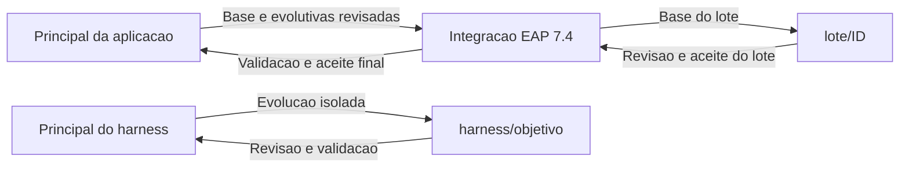

# Guia do desenvolvedor: harness de migracao

Repo independente para executar MTA pelo VS Code e preparar o planejamento de corretivas com GitHub Copilot, sob controle do desenvolvedor. Scripts, tarefas, prompt, configuracao e dois projetos de demonstracao estao aqui. **Siga este guia para configurar, executar e revisar cada etapa.** Todos os comandos partem da raiz do repositorio. Um clone permite ensaiar; depois, os exemplos podem ser substituidos pelos repositorios corporativos. JDKs, Maven, MTA e JBoss ficam nas pastas indicadas no JSON local.

## Roteiro: onde estou e o que escolho

Use **Terminal > Run Task**, com as tarefas da pasta `harness`. Confirme sempre
o projeto e o caminho dos fontes exibidos. Um workspace pode conter varios projetos;
a tarefa atua somente no alvo escolhido. Ter uma pasta aberta nao a torna o alvo.

| Etapa | Escolha do desenvolvedor | Resultado para conferir |
| --- | --- | --- |
| 1. Configurar | Caminhos desta maquina e workspace local | Ambiente encontrado; conferir caminhos nao executa build/MTA |
| 2. Build | Projeto/modulo e `clean install` no primeiro ensaio | `SUCCEEDED`, exit 0 e caminhos de `console.log`/`result.json` |
| 3. MTA | Mesmo projeto e fontes do build | Rodada bem-sucedida, integridade e relatorio HTML |
| 4. Preparar | Opcao 1: planejar/atualizar lote; selecionar MTA existente ou recebido e plano anterior, se houver | migracao.md atualizado, prompt e recibo; nenhuma corretiva executada |
| 5. Escolher issues e acionar Copilot | Salvar ANALISAR AGORA no registro; o prompt ja usa essas escolhas. Ajustar objetivo somente se necessario | Um `plan.md` e um `todo.md`, ainda sem GO |
| 6. Revisar | Pendencias tecnicas, rota, escopo e criterios de aceite | GO humano separado; branch escolhida pelo desenvolvedor |
| 7. Aplicar e validar | Aplicacao: preparar implementacao do lote; selecionar plano/to-do com GO e executar o prompt | Diff, build/testes, qualidade e validacao funcional; aceite humano |
| 8. Continuar | Evidencias disponiveis, novo MTA quando houver e proposta anterior | Reconciliar o lote; proximo lote somente apos aceite e pedido |

Se voce recebeu uma rodada MTA completa, pode iniciar na etapa 4 com a opcao **p**;
nao precisa repetir build/MTA apenas para preparar uma proposta nesta maquina.

Para consultar sem gerar outra solicitacao, use **Planejamento: abrir plano e to-do**.
A coleta Sonar tem a tarefa **Aplicacao: analisar SonarQube**; veja o
[roteiro Sonar local/corporativo](#sonarqube-local-ou-corporativo). Deploy e controle do servidor
ainda nao sao automatizados aqui.

Navegacao: [configuracao](#comecar-na-maquina-de-trabalho) ·
[projetos](#escolher-o-projeto-em-cada-tarefa) ·
[branches](#branches-e-conferencia-git) ·
[build](#build-maven-da-aplicacao-com-java-8) ·
[MTA](#analise-e-resultados) ·
[Copilot e documentos](#planejar-lotes-de-correcao-com-copilot) / [formacao do lote](#como-se-forma-o-lote-o-planmd-e-o-todomd) / [MTA recebido](#compartilhar-o-mta-e-planejar-em-outra-maquina) / [Sonar](#sonarqube-local-ou-corporativo) ·
[revisao com evidencias](#revisar-um-lote-com-evidencias-complementares) ·
[depois da revisao: GO, execucao e aceite](#da-proposta-revisada-a-execucao-e-ao-aceite) ·
[limpeza](#limpar-execucoes-para-repetir-o-ensaio).

## Comecar na maquina de trabalho

**Qual workspace abrir?**

| Arquivo | Quando usar |
| --- | --- |
| `iniciar-harness.code-workspace` | Somente na primeira configuracao, apos clonar. Modelo portavel com o harness e os exemplos. |
| `jboss-mta-harness.local.code-workspace` | No dia a dia, apos configurar. Contem seus caminhos e os projetos adicionados ao workspace; nao e versionado. |

**Se voce ja tem o workspace local configurado, continue abrindo `jboss-mta-harness.local.code-workspace`.** Nao precisa repetir a configuracao inicial nem gerar novamente para adicionar projetos. O arquivo inicial foi renomeado de `jboss-mta-harness.code-workspace` para `iniciar-harness.code-workspace`; seu workspace local permanece o mesmo.

Use uma pasta local permitida pela empresa. Tenha Git, VS Code e Windows PowerShell 5.1 disponiveis; para o planejamento assistido, use Copilot autenticado em sessao Local com o agente `devsquad` do plugin DevSquad disponivel e ferramentas de leitura/edicao habilitadas. Extraia a distribuicao Windows completa do MTA em uma pasta permitida, por exemplo `D:/ferramentas/mta` — **nao precisa ser `.kantra`**. Tenha tambem Maven, JDK do analisador (JDK 25 no ensaio) e JDK 8 da aplicacao. Se ja estiverem instalados, use essas instalacoes. O harness nao instala ferramentas nem exige variaveis globais.

Para o ensaio, nao precisa clonar outro repo: `exemplos/migracao-cache-antes` e `exemplos/migracao-cache-depois` ja acompanham este. JBoss 7.1/7.4 podem permanecer nas pastas onde foram extraidos; seus caminhos sao opcionais nesta primeira etapa. **Neste fluxo, o build Java 8 do projeto/modulo selecionado e obrigatorio antes da analise MTA. Build e analise sao tarefas separadas. Sonar e deploy ficam para etapas posteriores.**

Em uma pasta de repositorios permitida, execute:

```powershell
git clone https://github.com/edoardo-bianco/jboss-mta-harness.git
```

Os passos abaixo usam a **opcao A: configuracao pelo harness**. Para configurar a IDE diretamente, veja a [opcao B: configuracao manual do workspace](#opcao-b-configurar-o-workspace-manualmente).

1. Na primeira configuracao, use **File > Open Workspace from File** e abra `iniciar-harness.code-workspace`, na raiz do clone. Ele ja mostra `harness`, `migracao-cache-antes` e `migracao-cache-depois`, com caminhos relativos. Use-o para configurar os caminhos e gerar seu workspace local nos passos seguintes.
2. Execute **Terminal > Run Task > Workspace: configurar caminhos**. A tarefa cria e abre `config/harness.local.json`. Em configuracoes existentes, acrescenta somente campos Sonar ausentes, preservando os valores ja informados; confira os [padroes e requisitos Sonar](#configurar-uma-vez-por-maquina).
3. Preencha em `tools` os caminhos **desta maquina**, incluindo `applicationJdk8Home` e `applicationMavenHome`, e salve. Os dois exemplos e `activeProject: migracao-cache-antes` ja estao configurados; mantenha-os para o primeiro ensaio. Use o [exemplo completo abaixo](#configuracao-da-maquina). Para repositorios Maven privados/proxy, informe o `settings.xml` aprovado em `tools.mavenSettingsPath` (MTA) e `tools.applicationMavenSettingsPath` (build); podem apontar para o mesmo arquivo. Nao copie o settings da demo pessoal.
4. Execute **Terminal > Run Task > Workspace: gerar workspace**. Abra o arquivo gerado `jboss-mta-harness.local.code-workspace`, na raiz do clone, em **File > Open Workspace from File**. O Explorer deve mostrar `harness` e os projetos cadastrados. A partir daqui, use esse arquivo local para as tarefas e para adicionar seus projetos; quando Run Task pedir o arquivo de workspace, confirme esse nome.
5. Execute **MTA: conferir ambiente**, da pasta `harness`. Deve mostrar `OK`, o projeto certo, os caminhos locais, perfil `eap71-to-eap74-java8`, `Targets: eap7 | Modo: full` e filtro source nenhum. Se falhar, use **Workspace: configurar caminhos**, corrija o JSON e repita a conferencia.
6. Execute **Terminal > Run Task > Aplicacao: build Maven (Java 8)**, da pasta `harness`, e escolha `clean install`. Confira o projeto e a pasta de fontes exibidos: devem ser os mesmos que serao analisados pelo MTA. Aguarde `Status: SUCCEEDED` e `ExitCode: 0`. Se o build falhar, corrija a falha e repita antes de seguir. Veja [como selecionar o projeto/modulo](#build-maven-da-aplicacao-com-java-8).
7. Apos o build bem-sucedido, execute **MTA: executar analise** uma unica vez, escolhendo o mesmo projeto no terminal e mantendo as mesmas fontes. Aguarde o JSON final com `Status: SUCCEEDED`, `ExitCode: 0` e verificacoes de integridade verdadeiras. Para acompanhar, aguarde a mensagem `Rodada` e use **MTA: acompanhar atividade interna** em outro terminal: ela identifica automaticamente a analise em execucao, sem pedir projeto ou workspace. `Ctrl+C` nesse leitor nao para a analise.
8. Execute **MTA: abrir ultimo relatorio** para consultar o HTML. Depois use **Planejamento: preparar contexto para Copilot** e siga o [fluxo de planejamento](#planejar-lotes-de-correcao-com-copilot). A tarefa oferece a ultima rodada valida do projeto e permite escolher outra; nao precisa copiar os caminhos das evidencias.

**No dia a dia:** abra o workspace local e siga **build com sucesso → analise MTA → relatorio → planejamento dos lotes**, selecionando o mesmo projeto nas tarefas. Ao trocar o projeto/modulo ou alterar fontes, POMs ou configuracao de build, repita o build antes da proxima analise. A conferencia de ambiente valida os caminhos do MTA; o sucesso do build e conferido na tarefa propria. A tarefa MTA nao inicia o build nem bloqueia automaticamente sua execucao por falta dele: execute as etapas nessa ordem.

Ao abrir o workspace, a conferencia automatica usa a configuracao legada `repositories`/`activeProject` do JSON, quando disponivel, sem perguntar qual arquivo de workspace usar. Sem padrao, orienta executar a conferencia manual; esta permite informar o workspace e escolher um projeto. Se a configuracao necessaria estiver incompleta, abre o JSON. O VS Code pode pedir para permitir tarefas automaticas; a tarefa manual de configuracao funciona independentemente dessa permissao. Nenhuma analise comeca automaticamente.

Nos proximos dias, abra diretamente `jboss-mta-harness.local.code-workspace`. `iniciar-harness.code-workspace` fica como modelo para novos clones; nao precisa reabri-lo depois da configuracao. Relatorios, configuracao pessoal e workspace local nao acompanham o clone. Se uma politica impedir scripts, siga o procedimento de liberacao da empresa; este guia nao usa bypass nem altera ExecutionPolicy.

## Escolher o projeto em cada tarefa

Use **File > Add Folder to Workspace...** para adicionar os projetos Java/Maven e salve o workspace. **Nao e preciso cadastra-los em `repositories` no JSON do harness.** Cada pasta do workspace que contenha `pom.xml` aparece na selecao, incluindo agregadores e projetos com packaging `pom`, `jar` ou `war`. Para escolher um modulo separadamente, adicione tambem a pasta dele ao workspace. Pastas sem POM e a pasta do harness ficam fora da lista.

Em **Terminal > Run Task**, escolha a tarefa da pasta `harness`. Na entrada **Arquivo .code-workspace em uso**, confirme `jboss-mta-harness.local.code-workspace` se esse for o arquivo aberto. Se usar outro, informe seu caminho completo ou relativo a raiz do harness, sem aspas. No build, escolha tambem as fases na lista do VS Code. Em seguida, o terminal mostra uma lista numerada com nome e caminho dos projetos: digite o numero e pressione Enter. Isso vale para conferir ambiente, build, executar MTA, consultar o historico, abrir relatorio e preparar planejamento. Digite `q` no menu do terminal para cancelar sem executar. As duas tarefas **MTA: acompanhar...** localizam a analise em execucao automaticamente, sem essas perguntas.

Por exemplo, se `simtr-api` e `simtr-outsourcing-api` estiverem no workspace, ambos aparecem. Escolher um agregador executa o Maven no POM dele e inclui os modulos declarados; escolher um modulo usa o POM desse modulo. O nome da pasta nao determina seu papel.

`activeProject` e apenas um **padrao opcional**, pelo nome exibido no workspace ou caminho completo; Enter aceita esse padrao quando ele identifica exatamente um projeto. Sem padrao, escolha um numero. A escolha vale somente para a tarefa atual e nao altera o JSON nem o workspace. Se houver nomes repetidos, confira os caminhos na lista.

As tarefas **Workspace: configurar caminhos** e **Workspace: gerar workspace** cuidam da configuracao, sem alvo de build. A conferencia automatica ao abrir tambem nao solicita selecao. Adicionar/remover projetos no workspace nao exige gerar novamente; o gerador continua sendo uma opcao de criacao/sincronizacao a partir do JSON e pode substituir edicoes manuais.

As tarefas recebem o arquivo informado por `${input:harnessWorkspacePath}`, uma entrada `promptString` suportada pelo VS Code. `${workspaceFile}` nao e uma variavel nativa de tarefas; por isso o caminho e solicitado explicitamente, sem presumir qual workspace esta aberto. Veja a [referencia de variaveis do VS Code](https://code.visualstudio.com/docs/reference/variables-reference). Pelo terminal, passe `-WorkspacePath` e `-SelectTarget` para abrir o mesmo menu, ou `-Target "simtr-outsourcing-api"` para selecionar diretamente. Sem `-WorkspacePath`, os scripts mantem a compatibilidade com `repositories`/`activeProject` do JSON.

Historicos de projetos selecionados pelo workspace sao identificados pelo caminho, evitando misturar projetos homonimos e preservando a identidade quando o nome no Explorer muda. Rodadas antigas criadas pelo cadastro JSON continuam acessiveis pela execucao CLI sem `-WorkspacePath`; os arquivos existentes sao preservados.

## Duas opcoes para configurar o workspace

As duas opcoes configuram a IDE. Para executar as tarefas do harness, mantenha tambem `config/harness.local.json` preenchido, inclusive quando escolher a opcao manual.

| Opcao | Onde editar | Como aplicar |
| --- | --- | --- |
| **A — Pelo harness** | `config/harness.local.json` | Gerar novamente e abrir `jboss-mta-harness.local.code-workspace`. |
| **B — Manualmente no VS Code** | `settings` e, se necessario, `folders` do `.local.code-workspace` | Salvar o arquivo e criar um novo terminal Maven. Nao precisa executar Run Task nem gerar novamente. |

### Opcao A: editar o JSON local e gerar novamente

1. Abra `config/harness.local.json` diretamente ou use **Workspace: configurar caminhos**.
2. Ajuste `repositories`/`activeProject` e os caminhos reais em `tools`. Para o build,
   use `applicationJdk8Home`, `applicationMavenHome` e `applicationMavenSettingsPath`.
   `mtaJdkHome`, `mavenHome` e `mavenSettingsPath` continuam destinados ao MTA.
3. Salve e execute **Terminal > Run Task > Workspace: gerar workspace**. Alternativa
   no terminal PowerShell, a partir da raiz do harness:

   ```powershell
   powershell.exe -NoProfile -File .\scripts\gerar-workspace.ps1
   ```

4. Abra `jboss-mta-harness.local.code-workspace` em **File > Open Workspace from File**.
   O resultado esperado e ver os projetos de `repositories`, Java 8 para a aplicacao
   e Maven/settings correspondentes aos campos `application*`.

Gerar novamente sincroniza a IDE com o JSON; nao precisa fazer isso antes de cada build.
As tarefas do harness leem o JSON a cada execucao, mas o arquivo de workspace so muda
quando e gerado ou editado. O gerador reescreve `folders` e `settings` e guarda o arquivo
anterior em `.harness/workspace-backups/`: ajustes manuais podem ser sobrescritos.

### Opcao B: configurar o workspace manualmente

1. Abra seu `jboss-mta-harness.local.code-workspace`. Se so tiver `iniciar-harness.code-workspace`,
   abra-o e use **File > Save Workspace As...** para salvar uma copia com o nome
   `jboss-mta-harness.local.code-workspace`, na raiz do harness. Continue usando essa copia local.
2. Pressione **Ctrl+Shift+P > Preferences: Open Workspace Settings (JSON)**.
3. Dentro de `settings`, adicione ou ajuste as propriedades abaixo, preservando as
   demais configuracoes e `folders`. **Os caminhos sao ficticios:** use os existentes
   na sua maquina; o JDK da aplicacao deve ser Java 8. Se nao usar settings explicito,
   omita as duas propriedades de settings do exemplo para usar os padroes das ferramentas.

   ```json
   {
     "java.configuration.runtimes": [
       {"name": "JavaSE-1.8", "path": "D:/ferramentas/jdk8", "default": true}
     ],
     "java.jdt.ls.java.home": "D:/ferramentas/jdk-25",
     "maven.executable.path": "D:/ferramentas/apache-maven/bin/mvn.cmd",
     "maven.terminal.useJavaHome": false,
     "maven.terminal.customEnv": [
       {"environmentVariable": "JAVA_HOME", "value": "D:/ferramentas/jdk8"}
     ],
     "maven.settingsFile": "D:/config/maven/settings.xml",
     "java.configuration.maven.userSettings": "D:/config/maven/settings.xml"
   }
   ```

4. Salve. Apos terminar qualquer execucao em andamento, feche os terminais Maven antigos.
   No painel **MAVEN**, selecione o projeto e use **Run Maven Command > Custom** ou
   **Execute Commands...**, conforme a interface, com `--version` (sem `mvn`). Confira
   Java 1.8 e o Maven escolhido. Depois execute `clean install` pela mesma opcao.

`java.configuration.runtimes` identifica o JDK do projeto; `maven.terminal.customEnv`
define o Java do processo Maven. `java.jdt.ls.java.home` executa o servico Java da IDE
e pode continuar no JDK25. O Java da IDE nao precisa ser o mesmo Java do build.

**Editar o workspace nao atualiza `config/harness.local.json`.** Se tambem usar tarefas
MTA/build do harness, mantenha esse JSON configurado para elas. A extensao Maven usa o
POM selecionado; as tarefas oferecem os projetos do workspace. Escolha o mesmo projeto nos dois fluxos.
Configuracoes de pasta podem sobrescrever as do workspace. Se optar pela edicao manual,
nao gere novamente sem antes considerar os ajustes que serao substituidos.

**Recarregar a janela nao e gerar novamente o workspace:** `Developer: Reload Window`
reinicia a interface/extensoes; o gerador reescreve o arquivo a partir do JSON do harness.
Para o Java de um novo comando Maven, salve as configuracoes e crie um terminal Maven novo.

## Ensaiar e depois usar os projetos corporativos

| Projeto incluido | Conteudo e resultado esperado com MTA 8.2.1/regras ensaiadas |
| --- | --- |
| `migracao-cache-antes` | Codigo original, proveniente do commit `1bfbae96ebd39a3e996d07682ad88cd7af603cbf` da demo local. Regras `hibernate51-53-00400` e `00401` apontam a mesma chamada `getQueryCache()` em `LimpezaCache.java`; triagem precisa distinguir o overload e evitar dupla contagem. |
| `migracao-cache-depois` | Mesma aplicacao com a correcao minima `factory.getCache().evictDefaultQueryRegion()` e POM alinhado ao Hibernate `5.3.20.Final-redhat-00001` do EAP 7.4 local. Confira a rodada e o conteudo efetivamente analisados; relatorio anterior ao alinhamento do POM nao valida o estado novo. Nao e comprovacao de homologacao no EAP 7.4. |

As duas pastas incluem POM, fontes e testes Java 8. Sao projetos independentes para selecionar um por vez, nao modulos de um reactor comum. Foram preservados `javax.*`, WAR e contratos. No exemplo DEPOIS, `hibernate-core` permanece `provided` e `hibernate-ehcache` fica em `test`, ambos na versao do destino local; o POM declara o repositorio Red Hat GA. Na empresa, o repositorio Maven aprovado deve disponibilizar esses artefatos; confira a versao do EAP instalado. Ao corrigir ANTES numa branch, seu conteudo deixa de ser o baseline original: compare pelos snapshots das rodadas. A distribuicao MTA, caches Maven e resultados antigos nao sao publicados aqui.

Comece pelo `migracao-cache-antes`: selecione-o nas tarefas, execute o build, depois o MTA, abra o relatorio e use **Planejamento: preparar contexto para Copilot**. Para comparar com o exemplo ja corrigido, selecione `migracao-cache-depois`, conclua o build desse projeto e execute MTA novamente; cada projeto recebe suas proprias rodadas. Para um ensaio independente, o Copilot deve se limitar ao projeto selecionado, sem consultar a solucao do outro exemplo.

**Apos o ensaio, para manter apenas os projetos corporativos:**

1. Clone os repositorios reais em pastas externas ao harness, usando os meios aprovados pela empresa.
2. Use **File > Add Folder to Workspace...** para incluir os projetos corporativos. Remova as pastas dos exemplos do workspace pelo Explorer e salve o `.local.code-workspace`.
3. Execute as tarefas e selecione o projeto no terminal. Se desejar, ajuste `activeProject` para um padrao; o cadastro em `repositories` nao e necessario.
4. As pastas em `exemplos/` podem entao ser removidas, se desejado. Para continuar usando o gerador ou a CLI legada, atualize tambem `repositories`; as tarefas que recebem o workspace usam diretamente suas pastas, mesmo que esse cadastro esteja desatualizado.

Remover as entradas do workspace nao apaga codigo nem evidencias antigas. Nao ha exclusao automatica dos exemplos e nao e necessario mudar scripts para adicionar projetos corporativos.

## Tarefa e script correspondente

| Run Task | Arquivo em `scripts/` |
| --- | --- |
| Workspace: configurar caminhos | `configurar-caminhos.ps1` |
| Workspace: gerar workspace | `gerar-workspace.ps1` |
| Workspace: limpar execucoes | `limpar-execucoes.ps1` |
| MTA: conferir ambiente | `conferir-ambiente.ps1` |
| **Aplicacao: build Maven (Java 8)** | **`construir-aplicacao.ps1 -Goals <fases escolhidas>`** |
| Aplicacao: analisar SonarQube | `analisar-sonar.ps1` |
| Aplicacao: preparar implementacao do lote | `preparar-implementacao.ps1` |
| **MTA: executar analise** | **`executar-mta.ps1`** |
| **MTA: acompanhar log da analise** | **`acompanhar-log-mta.ps1 -Active`** |
| **MTA: acompanhar atividade interna** | **`acompanhar-log-mta.ps1 -Active -Detalhado`** |
| MTA: consultar log de execucao anterior | `acompanhar-log-mta.ps1 -SelectTarget -SelectRun -Once` (com workspace informado) |
| MTA: abrir ultimo relatorio | `abrir-relatorio-mta.ps1` |
| Workspace: conferir configuracao ao abrir | `conferir-ambiente.ps1 -AoAbrir` |
| Planejamento: preparar contexto para Copilot | `preparar-planejamento.ps1` |
| Planejamento: criar pasta de evidencias | `criar-pasta-evidencias.ps1` |
| Planejamento: abrir plano e to-do | `abrir-planejamento.ps1` |

Alternativa pelo terminal, na pasta deste repo: execute o build e confira seu sucesso antes de iniciar a analise. Se o build falhar, corrija-o antes de executar o segundo comando.

```powershell
powershell.exe -NoProfile -File .\scripts\construir-aplicacao.ps1 -WorkspacePath .\jboss-mta-harness.local.code-workspace -SelectTarget -Goals "clean install"
# Somente apos o build concluir com sucesso:
powershell.exe -NoProfile -File .\scripts\executar-mta.ps1 -WorkspacePath .\jboss-mta-harness.local.code-workspace -SelectTarget
```

## Configuracao da maquina

O exemplo versionado e `config/harness.example.json`; a tarefa cria dele o seu `config/harness.local.json`. Use caminhos reais com `/` ou `\\`, sem variaveis como `%JAVA_HOME%`. Caminhos relativos partem da pasta deste repo.

**Respeitar os padroes das ferramentas:** mantenha `mavenSettingsPath` e
`applicationMavenSettingsPath` como `null` no uso normal. Maven usa os settings
globais/usuario da maquina e seu repositorio local padrao, normalmente
`%USERPROFILE%\.m2\repository`. O harness nao cria settings, mirrors ou cache
Maven proprios. Informe um settings alternativo somente quando necessario,
por exemplo um arquivo corporativo aprovado. A geracao do workspace tambem
omite os overrides de settings quando esses campos estao null.

Exemplo completo para preencher na etapa 3. **Os caminhos de ferramentas abaixo sao ficticios:** substitua pelos existentes na maquina de trabalho. Os caminhos relativos dos dois exemplos ja sao validos no clone. Campos opcionais podem ficar `null`; JBoss e Sonar nao bloqueiam esta etapa.

```json
{
  "schemaVersion": 1,
  "activeProject": "migracao-cache-antes",
  "repositories": [
    {"name": "migracao-cache-antes", "path": "exemplos/migracao-cache-antes"},
    {"name": "migracao-cache-depois", "path": "exemplos/migracao-cache-depois"}
  ],
  "tools": {
    "mtaExecutable": "D:/ferramentas/mta/windows-mta-cli.exe",
    "mtaJdkHome": "D:/ferramentas/jdk-25",
    "mavenHome": "D:/ferramentas/apache-maven",
    "mavenSettingsPath": null,
    "applicationMavenHome": "D:/ferramentas/apache-maven",
    "applicationMavenSettingsPath": null,
    "applicationJdk8Home": "D:/ferramentas/jdk8",
    "eap71Home": null,
    "eap74Home": null
  },
  "sonar": {
    "serverUrl": null,
    "scannerJdkHome": null,
    "scannerVersion": "5.8.0.7211",
    "ceTimeoutSeconds": 300,
    "profiles": []
  },
  "mta": {
    "profile": "eap71-to-eap74-java8",
    "rulesPath": null,
    "sources": [],
    "targets": ["eap7"],
    "mode": "full"
  }
}
```

| Campo | Preencher com |
| --- | --- |
| `repositories` | Opcional para tarefas com workspace: usado pelo gerador e pela CLI legada sem `-WorkspacePath`. As tarefas do VS Code descobrem os projetos no workspace aberto. |
| `activeProject` | Padrao opcional: nome do projeto no workspace ou caminho completo. Pode ficar `null` ou ser omitido; escolha o alvo no menu de cada tarefa. Na CLI legada, corresponde ao `name` em `repositories`. |
| `tools.mtaExecutable` | Caminho completo do `windows-mta-cli.exe` dentro da distribuicao completa. Essa pasta tambem define onde o MTA busca seus componentes. |
| `tools.mtaJdkHome` | Pasta do JDK do analisador. O ensaio local utilizou JDK 25. |
| `tools.mavenHome` | Maven usado pelo MTA, com `bin/mvn.cmd`. |
| `tools.mavenSettingsPath` | Opcional: `settings.xml` aprovado para o MTA. Nunca coloque credenciais neste JSON. |
| `tools.applicationMavenHome` | Maven do build da aplicacao, com `bin/mvn.cmd`. Pode apontar para a mesma instalacao do MTA; depois pode ser trocado independentemente. |
| `tools.applicationMavenSettingsPath` | Opcional: `settings.xml` do build/importacao Java. Pode ter o mesmo caminho do MTA. Se null, Maven usa seus settings padrao; nao herda o campo do MTA. |
| `tools.applicationJdk8Home` | Obrigatorio para o build: pasta do JDK 8, tambem configurada no workspace para a aplicacao. |
| `tools.eap71Home`, `tools.eap74Home` | Opcionais: pastas dos JBoss ja extraidos, reservadas para a etapa de runtime. |
| `sonar` | Opcional no ciclo build/MTA; necessario para a task Sonar. URL, JDK do scanner, versao fixa e perfis conforme [guia Sonar](#sonarqube-local-ou-corporativo). Nunca gravar token. |
| `mta.rulesPath` | `null` usa `rulesets/java` ao lado da CLI; preencha se as regras Java estiverem em outra pasta. |
| `mta.runsPath` | Pasta dedicada externa para novas rodadas, por exemplo `"C:/mta-runs"`. `null`/ausente mantem `.harness/runs`. |
| `mta.profile` | `"eap71-to-eap74-java8"`: origem EAP 7.1, destino EAP 7.4, Java 8 e `javax.*`. |
| `mta.sources`, `mta.targets`, `mta.mode` | Mantenha `[]`, `["eap7"]` e `"full"`. O harness recusa desvios desse perfil. |

**Trocar projeto:** escolha outro alvo no menu, execute seu build e, apos sucesso, selecione-o no MTA. **Adicionar projetos:** use Add Folder to Workspace e salve. **Mudar ferramentas:** ajuste `tools` no JSON e sincronize as configuracoes da IDE pela opcao A ou B. O gerador substitui as pastas a partir de `repositories`, com backup em `.harness/workspace-backups/`; nao e necessario executa-lo para adicionar projetos ao workspace. Uma biblioteca visivel nao e compilada nem analisada automaticamente junto com outro repo.

## O que acompanha o clone

Scripts, tarefas, prompt, exemplo de configuracao, workspace inicial, dois projetos de demonstracao, testes e este README entram no Git. `config/harness.local.json`, o workspace gerado e `.harness/` sao locais e ignorados. O clone no trabalho pede os caminhos dessa maquina, sem carregar caminhos pessoais. **Este repo nao depende de outro harness nem dos checkouts locais usados para criar os exemplos.**

Os programas precisam estar instalados/extraidos nessa maquina. **O MTA pode ficar em qualquer pasta local permitida pela empresa; `.kantra` nao e obrigatorio.** Extraia a distribuicao Windows completa nessa pasta, preservando CLI, `java-external-provider.exe`, `jdtls/`, `rulesets/`, `static-report/` e os demais arquivos do ZIP. Nao basta mover so o executavel. Nao ha instalacao automatica nem alteracao de ExecutionPolicy.

Por exemplo, se a pasta permitida for `D:/ferramentas/mta`, informe `"D:/ferramentas/mta/windows-mta-cli.exe"` em `tools.mtaExecutable`. Com `mta.rulesPath: null`, as regras virao de `D:/ferramentas/mta/rulesets/java`. O harness define `KANTRA_DIR` com a pasta do executavel somente no processo da analise e restaura o valor anterior ao terminar, inclusive em caso de falha. Nao precisa configurar essa variavel globalmente. **MTA: conferir ambiente** mostra a pasta efetiva e confere a presenca dos componentes essenciais. [Resolucao da pasta pelo Kantra](https://github.com/konveyor/kantra/blob/main/pkg/util/util.go).

As tarefas usam Windows PowerShell 5.1. Java e Maven sao configurados somente no processo da analise, a partir do JSON: nao precisa ajustar `JAVA_HOME` ou PATH global. O JDK do MTA nao muda o Java 8/POM da aplicacao. Combinacao ensaiada: MTA 8.2.1, JDK 25 e Maven 3.9.16. A analise completa pode acessar os repositorios Maven definidos nos settings.

## Build Maven da aplicacao com Java 8

**Conclua o build do alvo antes de executar MTA.** Escolha o mesmo projeto do workspace nas duas tarefas. Se escolher um POM agregador, o build inclui seu reactor. Para analisar apenas um modulo, adicione a pasta desse modulo ao workspace e selecione-o; pais e dependencias de outros modulos devem estar disponiveis no repositorio Maven. Quando necessario, execute primeiro `clean install` no agregador para disponibiliza-los, depois construa e analise o modulo escolhido.

Preencha `tools.applicationJdk8Home`, `tools.applicationMavenHome` e, se necessario,
`tools.applicationMavenSettingsPath`. Os campos `mavenHome`/`mavenSettingsPath` continuam
exclusivos do MTA. Para usar a mesma versao por enquanto, informe o mesmo caminho nos
dois campos Maven; nao e preciso duplicar a instalacao. JSON antigo continua funcionando
na leitura da configuracao MTA; para seguir o fluxo completo, preencha tambem os campos do build.

Execute **Terminal > Run Task > Aplicacao: build Maven (Java 8)** e selecione o projeto no terminal.
Para preparar a analise, escolha `clean install` e aguarde o sucesso. A tarefa tambem
oferece `clean verify`, `clean package`, `test`, `package`, `verify`, `install` e `clean`
para outras operacoes; `clean` sozinho nao atende a etapa de build anterior ao MTA.
A tarefa mostra projeto, caminhos, versoes e log. Alternativa no
terminal PowerShell, a partir da raiz deste harness:

```powershell
powershell.exe -NoProfile -File .\scripts\construir-aplicacao.ps1 -WorkspacePath .\jboss-mta-harness.local.code-workspace -SelectTarget -Goals "clean install"
```

O padrao da tarefa e do script sem `-Goals` continua sendo `clean verify`; para seguir a preparacao descrita neste guia, selecione ou informe `clean install`. `clean` remove as saidas conforme o POM;
`install` percorre o ciclo ate instalar o artefato no repositorio Maven local.
Veja o [ciclo oficial do Maven](https://maven.apache.org/guides/introduction/introduction-to-the-lifecycle.html).
O harness passa `-Djacoco.haltOnFailure=false`: cobertura abaixo da meta de 85%
gera aviso, sem quebrar o build. Testes, instrumentacao e relatorios continuam
ativos; erros de compilacao e testes reprovados continuam retornando falha.
Em Maven direto, use `mvn -Djacoco.haltOnFailure=false clean install`.
Se o POM fixar `haltOnFailure=true` ou outro plugin impuser um gate, ajuste essa
configuracao no escopo aprovado do projeto; a task nao edita o POM nem mascara erros.
Ao configurar JaCoCo no POM, preserve os limites e use `haltOnFailure=false`,
conforme a [documentacao do JaCoCo check](https://www.jacoco.org/jacoco/trunk/doc/check-mojo.html).
Esta entrada aceita as fases acima (tambem `validate`/`compile`, com `clean` opcional),
sem linha de shell, flags avulsas ou goals arbitrarios de plugins. Perfis, plugins,
toolchains e `.mvn` existentes continuam sendo configuracao da aplicacao e precisam
estar revisados. Um toolchain ou compilador externo declarado no projeto pode selecionar
outro JDK: a conferencia do launcher nao certifica todo o bytecode produzido.

O executor usa `applicationJdk8Home` e `applicationMavenHome` somente no processo,
confere Java 8 e Maven 3 antes das fases e restaura o ambiente ao terminar. Opcoes
Java/Maven herdadas do terminal e scripts pessoais mavenrc nao sao usados; configuracao
versionada `.mvn` e settings declarados permanecem aplicaveis. O build ocorre na raiz
do projeto ativo, incluindo seu reactor. Nao execute outra IDE/CLI escrevendo nesse
projeto; a tarefa compartilha o lock do MTA deste harness.

Log e recibo ficam em `.harness/builds/<nome>__<chave12>/build_<data-fuso>__<RunId12>/console.log` e `result.json`.
O nome usa a data/hora de inicio do recibo e o fuso local; o RunId completo permanece
no JSON. Builds anteriores continuam nos caminhos originais.
O codigo de falha do Maven e propagado. `SUCCEEDED` significa Maven exit 0 para as
fases escolhidas; `clean` sozinho, testes desabilitados no POM ou ausencia de testes
nao comprovam teste/cobertura. Esta tarefa nao produz manifesto Sonar nem homologa EAP.
Depois de trocar o Maven/settings da aplicacao no JSON do harness, siga a opcao A para
sincronizar a IDE; se preferir editar a IDE diretamente, siga a opcao B em
[Duas opcoes para configurar o workspace](#duas-opcoes-para-configurar-o-workspace).
A tarefa de build le o JSON novamente em cada execucao.

### Usar a extensao Maven padrao do VS Code

Abra `jboss-mta-harness.local.code-workspace`. O gerador configura o `JAVA_HOME` do
terminal Maven em `maven.terminal.customEnv`, a partir de `applicationJdk8Home`, e
`maven.terminal.useJavaHome: false`. Configura tambem `maven.settingsFile` com
`applicationMavenSettingsPath` e `maven.executable.path` com o Maven da aplicacao.
O Java do servico da IDE (`java.jdt.ls.java.home`) continua separado do Java do build.
Esses valores sao atualizados sempre que voce gera novamente o workspace.

Depois de alterar/gerar o workspace, feche os terminais Maven antigos ja encerrados
e abra um novo; nao interrompa uma execucao em andamento. No painel **MAVEN**, clique
com o botao direito no projeto desejado, escolha **Execute Commands...** e digite
`--version`, sem `mvn`. Confira Java 1.8 e o Maven configurado. Depois use a mesma
opcao com `clean install` e aguarde `BUILD SUCCESS` antes de executar MTA. Confira que o POM selecionado corresponde ao projeto que voce escolhera na tarefa MTA. A extensao usa o POM selecionado
e nao passa pelo lock/recibo da tarefa do harness: execute uma operacao por vez.
Configuracoes particulares de pasta podem sobrescrever as do workspace.
Referencia: [configuracao da extensao Maven](https://github.com/microsoft/vscode-maven#additional-configurations).

## Analise e resultados

Mantenha o bloco `mta` do exemplo completo acima para preservar o perfil ensaiado.

**Origem/destino da migracao e filtros do MTA sao coisas distintas.** A CLI 8.2.1 ensaiada nao oferece target `eap7.4`. Usamos `eap7`, incluindo as regras Hibernate 5.1 para 5.3: no arquivo instalado `eap7/116-hibernate51-53.windup.yaml`, elas tem source `hibernate`/`hibernate5.1-` e target `eap7`. Acrescentar `--source eap7.1` excluiria essas regras. `sources: []` e intencional: nao envia `--source`. A selecao por rotulos e descrita no [guia de regras do Kantra](https://github.com/konveyor/kantra/blob/main/docs/rules-quickstart.md).

Preservamos `full`, `--run-local`, todas as regras YAML da pasta Java (sem fixtures de teste), `--enable-default-rulesets=false` e ausencia de `--json-output`. O perfil identifica o objetivo; nao reescreve regras nem transforma o conjunto amplo `eap7` em cobertura exata do EAP 7.4. O Copilot/desenvolvedor deve triar a aplicabilidade por versao e dependencia; o corrigido sera validado no EAP 7.4. Nao converter `javax.*` para `jakarta.*` nem trocar o target para `eap8`.

JSONs locais anteriores, sem `profile` e `sources`, recebem esses valores em memoria; caminhos permanecem inalterados. As novas rodadas registram perfil, origem/destino e filtros no manifesto, alem dos argumentos e hashes das regras. Atualizar a distribuicao ou `rulesPath` exige conferir novamente a comparabilidade com o baseline: o nome do perfil sozinho nao garante regras identicas.

Sem `mta.runsPath`, cada nova rodada fica em `.harness/runs/<nome>__<chave12>/mta_<data-fuso>__<RunId12>/`, com copia do reactor e das regras, `manifest.json` (argumentos/hashes), `console.log`, `result.json` e `output/static-report/index.html`. A pasta usa o instante CreatedAtUtc do manifesto convertido para horario local com fuso; o ID completo permanece nos recibos. Excluimos `.git`, `.harness`, `.scannerwork`, `node_modules` e pastas Maven `target`; preservamos `.mvn` e os modulos. Modulos/pais externos precisam estar disponiveis no Maven ou incluidos na raiz escolhida. Links/junctions nao sao suportados. As fontes originais e as regras sao conferidas depois da execucao.

**Pasta curta externa para projetos com caminhos longos:** em **Workspace:
configurar caminhos**, acrescente/ajuste somente `runsPath` no bloco `mta` de
`config/harness.local.json`, preservando os outros campos:

```json
"runsPath": "C:/mta-runs"
```

Salve e execute novamente **MTA: executar analise**. Nao precisa mover o harness
nem alterar o workspace. A pasta precisa permitir escrita ao seu usuario e ficar
fora do harness e dos projetos. Novas rodadas usam
`C:/mta-runs/<nome-projeto>/yyMMdd-HHmmss/`, por exemplo
`C:/mta-runs/SIMTR-Outsourcing-api/260930-151210/`, com `input`, `rules`, `output`,
logs e recibos. A data/hora usa o horario local; o instante UTC e o RunId completo
continuam no manifesto. Horarios repetidos recebem `-2`, `-3` etc., sem sobrescrever.
O nome do projeto usa o rotulo do workspace/configuracao, com caracteres seguros
e limite de 64 caracteres. Nomes iguais de projetos/fontes diferentes recebem
sufixos numericos. `project.json` na pasta do projeto identifica `Label`, `Project`
e `Source`; `manifest.json` em cada rodada registra tambem o Git observado.
Nomes dos fontes e estrutura dos modulos sao preservados. A pasta local da rodada
guarda `location.json`, incluindo o caminho relativo do destino externo.
Logs, relatorio e planejamento resolvem essa referencia, inclusive apos trocar
`runsPath` ou voltar a null. Historico existente nao e movido nem reescrito.
Rodadas externas anteriores em `p__<chave12>/<RunId>/` continuam acessiveis.
Na limpeza, a pasta do projeto e seu `project.json` permanecem; somente as rodadas
registradas e selecionadas sao removidas, preservando a identificacao para reuso.
Ao mover o harness, leve tambem `.harness/`: os indices continuam validos se a
aplicacao e a pasta externa permanecerem no lugar. A raiz antiga em `IndexPath`
e historica; projeto, fonte, RunId e trecho do indice sob `.harness/runs` continuam
conferidos. Nao e necessario reexecutar MTA ou editar os manifestos.

Se os indices nao estiverem disponiveis, ou a rodada vier de um colega, preserve
a **pasta completa da rodada**. A tarefa **MTA: abrir ultimo relatorio**, quando
nao consegue localizar o ultimo relatorio, pede essa pasta (Enter/q cancela).
Tambem e possivel abrir diretamente, mesmo sem configuracao/cadastro local:

```powershell
.\scripts\abrir-relatorio-mta.ps1 -RunPath 'C:\mta-runs\SIMTR-Outsourcing-api\260930-154744'
```

O caminho acima e ilustrativo: informe a pasta que contem `manifest.json`,
`result.json`, `input`, `rules` e `output`. O leitor confere resultado, identidade
interna e evidencias e abre `output/static-report/index.html` na localizacao atual.
Nao altera origem, indices nem ultimo sucesso local. Para planejar a partir dessa
rodada, use a opcao `p` da tarefa de planejamento. Nao basta copiar so o HTML;
para compartilhar apenas a visualizacao, envie `static-report` inteira e abra
seu `index.html` diretamente no navegador.

O snapshot usa caminhos estendidos internamente para enumerar/copiar/calcular
SHA-256 acima de 260 caracteres no PowerShell 5.1; manifestos e comandos MTA
mantem caminhos normais. A pasta externa curta tambem reduz o caminho recebido
pelo MTA/Java. Isso nao certifica todos os limites das ferramentas externas:
confira `Status`, exit code e integridade na nova rodada real do projeto.

Rodadas antigas em `.harness/runs/<Project>/<RunId>/` continuam acessiveis nas
mesmas tarefas. O harness le ambos os formatos, inclusive ultimo relatorio,
analise ativa, logs e planejamento. Confere projeto/fonte e ID completo no
manifesto; mudar o rotulo do projeto nao perde o historico. Copias com o mesmo
RunId dentro da area de rodadas sao recusadas como ambiguas.

Uma falha nao substitui o ultimo relatorio concluido do projeto. `SUCCEEDED` confirma a execucao e as verificacoes locais, nao a homologacao no EAP 7.4. Sonar e deploy ficam para etapas posteriores.

### Acompanhar a analise MTA

**Acompanhar a execucao atual:** o terminal de **MTA: executar analise** ja mostra a saida. Para abrir um leitor separado, aguarde a mensagem `Rodada` e execute **MTA: acompanhar log da analise**. Ela se vincula automaticamente a analise MTA em execucao neste harness, sem pedir projeto ou workspace; mostra projeto, fontes, RunId e caminho do log. Exibe as ultimas 40 linhas e acompanha novas linhas dessa rodada. `Ctrl+C` encerra somente o leitor. Ele fica nessa rodada e nao muda para outra automaticamente; encerre-o ao concluir e confira o JSON final no terminal original. Se encontrar o resultado ao abrir, mostra-o e encerra. Sem MTA ativo, informa que nao ha analise em execucao; um build ou registro antigo nao conta como analise ativa. Se o log ainda nao existir, informa a situacao sem abrir um log antigo.

**Consultar uma execucao anterior:** execute **MTA: consultar log de execucao anterior**, confirme o workspace e escolha o projeto. Depois escolha a rodada na lista, que mostra data/hora local com fuso, resultado e RunId, da mais recente para a mais antiga. A ordem usa o instante do manifesto, nao a data de copia da pasta. A tarefa exibe o resultado salvo, o caminho do `console.log` e suas ultimas 40 linhas, sem executar MTA nem seguir novas linhas. `SEM RESULTADO` indica ausencia de recibo, nao comprova que a rodada esteja em execucao. Para ler tudo, abra o arquivo pelo caminho exibido. Builds Maven ficam em `.harness/builds/` e nao aparecem nesse historico MTA.

Para escolher uma rodada explicitamente, use `powershell.exe -NoProfile -File .\scripts\acompanhar-log-mta.ps1 -WorkspacePath .\jboss-mta-harness.local.code-workspace -SelectTarget -RunId <id>`. Adicione `-Once` para mostrar somente as ultimas linhas, sem esperar. O leitor nao inicia/cancela MTA nem altera arquivos; nao acompanha os logs internos do JDT.

**Console sem novas mensagens:** use **MTA: acompanhar atividade interna**. No mesmo script, `-Active -Detalhado` identifica a analise em execucao e consulta `.metadata/.log` da rodada a cada 5 segundos, mostrando horario/idade da ultima gravacao e ate quatro linhas resumidas de mensagens/classes/consultas. Le no maximo 16 KiB por consulta e reabre o arquivo para tolerar rotacao, sem despejar o log inteiro. Nao altera o nivel de log nem a analise. Encerra ao encontrar `result.json` legivel ou com `Ctrl+C`; acrescente `-Once` para fazer apenas uma consulta. Logs atualizados indicam atividade, nao porcentagem/progresso garantido; silencio sozinho tambem nao comprova travamento. Esta visao usa o formato JDT observado na CLI ensaiada e pode ficar indisponivel em outra versao.

## Branches e conferencia Git

**A equipe controla branches e integracoes.** O harness nao cadastra papeis Git,
nao bloqueia planejamento por branch/HEAD e nao faz merge ou push automaticamente.
MTA/build registram Git como referencia; novos contextos de planejamento usam a
origem MTA e o projeto local, sem coletar Git. A [ADR-0004](../adr/0004-git-informativo-sem-controle-de-branches.md)
substitui os controles antigos da ADR-0003.

### Estrutura de branches ao longo da migracao

Este e o fluxo de organizacao adotado no ensaio, adaptavel aos nomes e politicas
da equipe. Os nomes nao sao requisitos do planejamento. `main` pode se chamar
`develop`; a integracao pode ser `develop_jboss_eap74`. Principal nao significa
deploy automatico em producao.

| Branch | Papel e origem | Quando recebe alteracoes |
| --- | --- | --- |
| `main` (ou `develop`) da aplicacao | Linha principal; pode continuar recebendo evolutivas durante a migracao. | Recebe a migracao apos validacao e aceite final, pelo fluxo de revisao da equipe. |
| `main_jboss_eap74` | Integracao da migracao, criada a partir da principal da aplicacao. | Acumula lotes aceitos e atualizacoes pertinentes da principal; o estado integrado precisa ser revalidado. |
| `lote/<ID-do-lote>` | Corretiva de um unico lote; no fluxo recomendado, nasce da integracao EAP 7.4 atualizada. | Recebe implementacao/testes com GO; depois de revisao e aceite, integra na EAP 7.4. |
| `harness/<objetivo>` | Evolucao de scripts, prompts, tasks e documentacao; nasce da principal do repositorio do harness. | Recebe somente a evolucao do harness; depois de revisao/validacao, integra na principal do harness. |

### Matriz de origem e destino por fase

**ORIGEM fornece o codigo; DESTINO recebe as alteracoes.** Na criacao de branch,
ORIGEM e a base inicial; nas integracoes, e a branch cujas alteracoes serao
revisadas e incorporadas. Os exemplos abaixo sao do repositorio da aplicacao.

| Fase | ORIGEM | DESTINO | Acao e ponto de conferencia |
| --- | --- | --- | --- |
| 1. Abrir a frente de migracao | `main` | Nova `main_jboss_eap74` | Criar a integracao a partir da principal escolhida e identificar a base analisada pelo MTA. |
| 2. Iniciar a corretiva de um lote | `main_jboss_eap74` atualizada | Nova `lote/<ID>` | Criar a branch de trabalho sobre a base pretendida; implementar somente o lote com GO. A Run Task parte do HEAD atual, sem atualizar a base automaticamente. |
| 3. Incorporar evolutivas durante a migracao | `main` | `main_jboss_eap74` | Comparar evolutivas, revisar impactos, integrar e revalidar o codigo resultante. As corretivas de migracao ja presentes no destino devem ser preservadas. |
| 4. Atualizar um lote ainda em andamento, quando necessario | `main_jboss_eap74` | `lote/<ID>` | Incorporar mudancas pertinentes da integracao, resolver sobreposicoes e conferir se plano, corretiva e testes continuam aplicaveis. A equipe coordena essa operacao. |
| 5. Integrar o lote aceito | `lote/<ID>` | `main_jboss_eap74` | Revisar o diff contra o escopo aprovado, integrar pelo fluxo da equipe e revalidar o estado integrado. Novo MTA e reconciliacao orientam o proximo lote solicitado. |
| 6. Entregar a migracao concluida | `main_jboss_eap74` | `main` | Apos validacao e aceite final, revisar o conjunto migrado, integrar e validar o commit resultante. Publicacao/deploy do artefato seguem autorizacao propria. |

O percurso normal da corretiva e **integracao EAP 7.4 -> lote -> integracao EAP 7.4**.
Enquanto isso, evolutivas seguem **principal -> integracao EAP 7.4**. O retorno
**integracao EAP 7.4 -> principal** e a entrega final da migracao, depois do aceite;
nao acontece a cada push de lote. Repita o ciclo dos lotes sobre a base integrada,
sem planejar antecipadamente todas as corretivas.

Antes de integrar, confirme repositorio e referencias concretas. `origin/main`
e `origin/main_jboss_eap74` representam o ultimo estado remoto obtido por fetch;
as branches locais podem conter trabalho ainda nao publicado. O documento
[de comparacao de branches](diagnostico-branches-git-tortoisegit.md#escolher-a-direcao-da-comparacao)
detalha os comandos e as diferencas entre comparar historico e conteudo. A matriz
aqui explica a estrategia; nenhuma dessas operacoes e automatizada pelo planejamento.



**Antes do primeiro lote:** a equipe prepara a integracao EAP 7.4 a partir da
principal e analisa esse codigo, ou reutiliza um MTA pertinente conferindo os
pontos locais. Planejar nao exige criar branch de lote nem autoriza editar codigo.

**Ao implementar:** registre GO e selecione a base pretendida antes de executar
**Aplicacao: preparar implementacao do lote**. A opcao 1 cria `lote/<ID>` a partir
**do HEAD atual exibido**, e nao procura nem atualiza `main_jboss_eap74` sozinha.
A opcao 2 mantem a branch atual; a 3 cria um nome informado. Confira a base e o
checkout: o nome da branch nao garante que contenha as ultimas integracoes.

**Ao concluir um lote:** confira diff, verificacoes e pendencias, obtenha aceite e
integre pelo processo da equipe. Push publica a branch; **nao integra** as mudancas
na principal nem na EAP 7.4. Depois da integracao, revalide o codigo resultante;
para planejar o proximo lote, reconcilie o historico e evidencias dessa base;
se nao houver novo MTA, mantenha a comparacao pendente.
A branch do lote pode permanecer publicada como historico; o harness nao a apaga.
Registre tambem o commit integrado e as evidencias da verificacao.

**Durante a migracao:** avalie novas evolutivas da principal e integre as pertinentes
na EAP 7.4, resolvendo sobreposicoes e revalidando os lotes afetados. Frentes
simultaneas usam branches/checkouts separados; `.harness` local nao coordena
desenvolvedores e nao e lock compartilhado.

**Ao finalizar:** reconcilie a cobertura, resultados e pendencias, obtenha aceite
final e integre EAP 7.4 na principal pelo fluxo aprovado. Identifique o commit e
o artefato validado. Publicar ou integrar nao autoriza deploy: a promocao para o
servidor segue uma decisao e rotina proprias da equipe.

### Branch exclusiva para alterar o harness

Use `harness/<objetivo>` derivada da principal, com `tasks/plan.md` e `tasks/todo.md`.
Revise/valide antes de integrar. Com migracao em andamento, use worktree/checkout
separado; nao troque a branch usada por outro agente.

**No ensaio deste repositorio**, harness e exemplos compartilham a raiz Git:
trocar a branch afeta ambos. Apos integrar uma evolucao do harness na principal,
leve-a explicitamente para `main_jboss_eap74`, conferindo conflitos e impactos nas
evidencias. Isso nao incorpora automaticamente branches de lote. Um commit
publicado apenas em `lote/HIB-CACHE-001` ainda precisa de integracao para aparecer
nas branches principais.

**Na empresa, com repositorios separados**, atualizar o harness nao altera branches
da aplicacao. Cada repositorio tem sua principal e seu fluxo; o workspace apenas
os apresenta juntos. Nunca use a branch do harness para identificar o codigo de
outro projeto. Planos de corretivas ficam nos destinos do contexto, fora de `tasks/`.

### Historico e transicao

Trocar branch/HEAD nao exige novo contexto nem MTA por si so. Confira fontes,
POMs e configuracoes relevantes. Se mudaram, registre alerta, avalie aplicabilidade
e recomende novo MTA; nao atribua o commit atual a uma analise antiga.
GO e aceite humano continuam separados.

`gitPolicies` antigas sao ignoradas. A tarefa de conferir Git foi removida e nao
e pendencia a renovar. Recibos/planos antigos permanecem historicos; ao revisar,
substitua somente exigencias superadas, preservando pendencias tecnicas reais.
Os comandos de comparacao e diagnostico visual ficam no documento separado
[Git/TortoiseGit](diagnostico-branches-git-tortoisegit.md).

## Planejar lotes de correcao com Copilot

O registro do projeto concentra escolhas; o plano detalha um unico lote. A Run Task
prepara os arquivos e **voce executa o prompt** no Copilot. Preparacao nao concede
GO nem aplica corretivas. Os planos da aplicacao ficam em .harness/planning/;
tasks/ pertence a evolucao do harness.

### Registro de migracao por projeto

Ao gerar o workspace ou executar a primeira tarefa apos adicionar um projeto,
o harness cria, sem sobrescrever:

```text
.harness/projetos/<nome>__<chave>/
  migracao.md
  evidencias/LEIA-ME.md
```

A chave identifica a raiz local, inclusive agregadores Maven; modulos nao recebem
registros separados implicitamente. Rotulos iguais em raizes diferentes ficam
separados. Alterar o nome no Explorer ou alternar entre configuracao e workspace
nao duplica a pasta. Remover o projeto do workspace nao apaga seu registro.

Antes do MTA, o documento fica AGUARDANDO MTA. Ao escolher uma rodada, recebe uma
linha por issue (ruleset::regra), com titulo, categoria e numero de ocorrencias.
Os dados vem de output/static-report/output.js, lido como JSON sem executar JavaScript.
O harness nao inventa as demais issues a partir de um print parcial.
Formato nao suportado e informado. Rodada antiga sem output.js continua utilizavel
no planejamento, mas nao preenche o catalogo automaticamente.

Edite as escolhas no migracao.md; mantenha as oito colunas e os marcadores da tabela:

| Campo | Uso |
| --- | --- |
| Decisao | A DEFINIR, ANALISAR AGORA, ADIAR ou FORA DO ESCOPO, com justificativa humana. |
| Andamento | NAO ANALISADA, ANALISADA, PLANEJADA, IMPLEMENTADA ou VERIFICADA. |
| Observacao/referencia | Cobertura parcial, motivo, plano/evidencia e declaracoes de colegas. |
| Presenca | PRESENTE na rodada selecionada; NAO REENCONTRADA preserva a ultima contagem, sem afirmar correcao. |

Analisar 20 de 138 ocorrencias nao conclui toda a issue. Correcao de colega ainda
ausente no codigo local fica AGUARDANDO INTEGRACAO na observacao, com referencia.
Issues adicionais usam ID DEV-..., categoria manual, contagem - e presenca MANUAL.
Para escrever barra vertical dentro de celula, use &#124;.
Nenhum status concede GO ou aceite. Entre desenvolvedores, a conciliacao e manual;
arquivo mais recente nao vence automaticamente um conflito.

### Reconstruir a pasta usando um MTA existente

Nao precisa repetir a analise. Se pretende planejar um lote agora, use diretamente
a opcao 1 descrita abaixo: ela tambem cria/atualiza o registro a partir do MTA.
Para somente reconstruir ou atualizar o registro, sem planejar:

1. Use **Planejamento: preparar contexto para Copilot > 2. Atualizar somente migracao.md**.
2. Escolha **1: selecionar MTA**. Use Enter para a ultima elegivel, **h** para o
   historico ou **p** para informar a pasta completa da rodada.
3. Confira o caminho do migracao.md exibido. A pasta e o catalogo foram criados;
   se ja existiam, escolhas, observacoes e issues manuais foram preservadas.
4. Para recuperar andamento, forneca registro anterior ou planos/evidencias pertinentes
   e execute manter-migracao. Somente o MTA inicializa A DEFINIR/NAO ANALISADA;
   ele nao comprova analise, implementacao ou verificacao realizadas anteriormente.

O prompt manter-migracao e gerado para ajuda opcional do Copilot: ele interpreta
as evidencias e reconcilia decisoes/andamento somente no migracao.md, sem gerar
plan.md/todo.md. Se queria apenas extrair o catalogo do MTA ou prefere editar o
registro manualmente, a tarefa ja cumpriu esse objetivo; nao precisa executar o prompt.

Ao executar manter-migracao, o DevSquad pode escolher um subagente para ajudar na
leitura e reconciliacao. Esse apoio e opcional e somente devolve uma proposta;
o condutor confere as evidencias e grava apenas migracao.md. Conflitos humanos
permanecem para sua decisao. Nenhum dos agentes planeja lotes ou altera a aplicacao.

Para receber um registro de colega, use o parametro MigrationSourcePath abaixo.
O arquivo recebido e entrada; o destino continua sendo o migracao.md local.
Conflitos ficam visiveis para conciliacao, sem substituir decisoes silenciosamente.

```powershell
.\scripts\preparar-planejamento.ps1 -WorkspacePath .\jboss-mta-harness.local.code-workspace -SelectTarget -Operation manter-migracao -RunPath "C:\mta-runs\SIMTR-api\260930-154744" -MigrationSourcePath "C:\recebidos\migracao.md"
```

Para atualizar somente observacoes/evidencias, escolha **2: somente registro/evidencias
existentes**, sem selecionar outro scan. Pela CLI, use -WithoutMta no lugar de
-RunPath. Pode informar -EvidenceIndexPath para um LEIA-ME existente fora da pasta
padrao. Planos anteriores podem ser referenciados nesse indice como evidencias;
o mantenedor nao os altera. Manter registro e opcional: nao precisa executa-lo
novamente antes de cada planejamento.

### Preparar e executar o prompt

1. Use **Planejamento: preparar contexto para Copilot > 1. Planejar ou atualizar lote**.
   Escolha projeto e MTA: Enter ultima elegivel, h historico, p pasta completa, q cancela.
2. Se houver proposta anterior, selecione-a para atualizar o mesmo lote; Enter inicia
   independente. Previous nao concede GO nem transfere aprovacao.
3. Abra o migracao.md no caminho exibido, marque ANALISAR AGORA nas issues desejadas
   e salve. A preparacao ja preencheu/atualizou o catalogo quando disponivel no MTA;
   escolhas existentes foram preservadas. Editar o registro nao exige novo preparo.
4. O objetivo padrao do prompt e planejar um lote a partir das issues ANALISAR AGORA.
   Altere **Direcionamento do desenvolvedor** somente se quiser outro objetivo ou
   acrescentar observacoes; nao precisa repetir as escolhas do registro.
   Confira o contexto ao final: caminhos, rodada e destinos. O recibo guarda o
   registro no momento do preparo e a copia do contrato tecnico; o registro segue editavel.
5. Use **Executar Prompt** em nova conversa **Copilot Local** com devsquad ou a
   chamada /planejar-lotes mostrada no terminal. O condutor delega a devsquad.plan,
   grava/rele o plano/to-do e registra andamento/cobertura das issues trabalhadas.
6. Abra os resultados com **Planejamento: abrir plano e to-do** e revise.

O plugin deve disponibilizar devsquad, devsquad.plan e skills pertinentes.
Confira **Chat: Open Customizations** e **Configure Tools**: subagente
(agent/runSubagent), leitura/busca e edicao. O harness nao instala o plugin.
Se .harness estiver oculta, abra o caminho exibido com Ctrl+P. Ausencia na busca
nao prova ausencia do arquivo. Resposta apenas no chat nao substitui a proposta salva.

A abertura usa bin/code.cmd da mesma instalacao indicada pela tarefa (code-insiders.cmd
no Insiders), com --reuse-window. O terminal informa a CLI usada e eventuais falhas;
os arquivos ja preparados permanecem salvos. Se a aba nao aparecer, use Ctrl+O com
o caminho exibido, sem preparar outra solicitacao nem limpar o cache do editor.

O prompt [planejar-lotes](../../.github/prompts/planejar-lotes.prompt.md) atende inicio
e revisao; revisar-lote permanece para contextos antigos. Nao ha segundo prompt
obrigatorio nem ciclo de manutencao/planejamento repetido. Na retomada, preserve
ID e trabalho feito. O limite e uma elaboracao e uma correcao tecnica consolidada
pelo especialista; forma/fatos conferidos sao ajustados pelo condutor. Sem terceiro
ciclo de regeneracao. Os testes de scripts nao comprovam obediencia do Copilot.

Planejamento nao executa terminal, Git, Maven, MTA, Sonar, web ou corretivas.
Limites sao instrucoes comportamentais, nao sandbox tecnica dos subagentes.
O contrato unico esta na [especificacao existente](../especificacoes/planejamento-copilot.md).

### Como se forma o lote, o plan.md e o todo.md

O agente aprofunda somente as issues escolhidas e pontos relacionados. Varias issues
so formam um lote com causa/solucao, aceite e reversao comuns. Dependencia em issue
adiada/excluida exige decisao; sem selecao clara, o agente recomenda e pede escolha.
Categoria mandatory nao transforma todo o relatorio em um lote.

O agente confere regras MTA, snapshot input e pontos correspondentes no Source,
POMs, consumidores, testes e configuracoes relevantes. Distingue contagem bruta,
cobertura analisada e alteracoes deduplicadas. Justifica rota assistida/OpenRewrite/
combinada, riscos, testes e pendencias sem inventar resultados.

| Documento | Conteudo |
| --- | --- |
| migracao.md | Escolhas/andamento por issue, cobertura e referencias. Nao substitui o plano tecnico. |
| plan.md | Identidade, Lote ativo, proposta, POM/dependencias, escopo, verificacoes, reversao, historico e decisao humana. |
| todo.md | Mesmo Lote ativo, link para plano/decisao e tarefas com evidencia de conclusao. Sem repetir a analise. |

Java 8, javax.* e EAP 7.4 permanecem; nao migrar para jakarta.*. Lote Hibernate inclui
alinhar compilacao/testes ao ORM 5.3; patch exato depende de evidencia do destino.
Conferir propriedade/parent/BOM, integracoes e escopos provided/test, sem embutir
Hibernate no WAR. Build em 5.1 nao comprova 5.3; dispensa previa nao elimina a entrega.

### Localizar documentos e identificar o historico

**Planejamento: abrir plano e to-do** lista propostas salvas, pelo projeto/datas/IDs.
RunId identifica MTA; RequestId identifica solicitacao; Previous aponta a anterior.
Lote ativo identifica o trabalho mantido entre revisoes, independentemente do RunId.

Solicitacoes ficam em
`.harness/planning/<nome>__<chave>/mta_<data-fuso>__<RunId12>/plano_<data-fuso>__<RequestId12>/`.
Ali ficam prompt, context.json e, apos o agente, plan.md/todo.md. Manutencao do
registro usa `registro/solicitacao_<id>` sob a pasta de planejamento do projeto e nao aparece
como lote no menu. Formatos historicos continuam legiveis, sem renomeacao.
Novos preparos usam o contrato atualizado; nao e preciso repetir MTA para isso.

### Compartilhar o MTA e planejar em outra maquina

Para consulta visual, copie output/static-report inteira; somente index.html nao
basta. Para registro/planejamento, envie a rodada completa: manifest.json, result.json,
input, rules e output. O destinatario seleciona projeto local e usa **p** no menu.
Nao e necessario copiar toda .harness ou igualar caminhos/branches das maquinas.

Pode copiar uma rodada antiga para `C:/mta-runs/<projeto>/AAMMDD-HHMMSS` e renomear
apenas a pasta, usando data/hora original. Nao altere RunId, datas ou caminhos dos
manifestos/resultados. Informe a copia por p/RunPath; renomear nao a cadastra como
ultimo relatorio. Preserve a pasta original enquanto planos antigos a referenciarem.
O snapshot contem fontes; confira o conteudo e os destinatarios do compartilhamento.

MtaOrigin preserva identidade/Source/RunId da origem; AnalysisSource e o input atual
da rodada e Source e o projeto local. Diferencas Maven/codigo geram alertas; o agente
confere aplicabilidade e recomenda novo MTA se necessario, sem bloquear por caminho/Git.
Analise sem sucesso/integridade ou rodada incompleta continuam erros de entrada.
A pasta recebida nao e copiada/importada nem apagada pela limpeza de rodadas locais.

### Revisao manual do plano e do to-do

Para completar a entrega atual, peca ajuste na mesma conversa/destinos; nao precisa
refazer task, build ou MTA. Para registrar uma revisao separada, salve observacoes
no plano, prepare contexto escolhendo-o como Previous e execute planejar-lotes.
Preencha somente o que mudou no direcionamento; preserve ID, historico e pendencias.
Nova proposta/revisao de escopo nao herda GO automaticamente. Nao edite recibos/MTA.

### Revisar um lote com evidencias complementares

Use **Planejamento: criar pasta de evidencias** para abrir o indice do projeto.
Repetir a tarefa reabre o mesmo indice, preservando seu conteudo. Liste arquivos
relativos e sua relacao com a correcao; nao precisa de lote anterior.

| Arquivo relativo | Relacao com a correcao |
| --- | --- |
| build-antes-result.json | Resultado ANTES; informar origem/data quando conhecidos. Nao comprova testes DEPOIS ou runtime. |

O indice padrao ja entra no preparo. Indice antigo/externo usa -EvidenceIndexPath.
O [modelo existente](modelo-evidencias-complementares.md) serve como referencia
para preenchimento manual. Nao exige formulario/hashes adicionais; o agente le
somente os arquivos listados. Preserve evidencias ja usadas e dê nomes distintos
a novos resultados. Pastas antigas .harness/evidencias continuam preservadas.

Se ha novo MTA, selecione-o junto com Previous. Compare persistentes, novas,
nao reencontradas e inconclusivas; nao altere o RunId de contexto ja preparado.
Se mudou somente feedback/evidencia, reutilize a rodada pertinente.

### Da proposta revisada a execucao e ao aceite

GO autoriza implementar; aceite aprova o resultado depois. Novos planos trazem uma
unica secao **Decisao humana** no plan.md; todo.md aponta para ela:

```text
Responsavel:
GO humano: PENDENTE
Pendencias dispensadas como precondicao: nenhuma.
Aceite do resultado: PENDENTE.
```

Preencha nome e GO com "autorizo implementar este plano e seu to-do". Data opcional.
GO generico mantem precondicoes; para dispensa, identifique quais ou escreva
"todas as precondicoes listadas". Verificacoes ausentes continuam pendentes.
Documentos antigos com decisao nos dois arquivos continuam aceitos, sem exigir
preencher GO duplicado. O agente nao responde pelo humano.

Sonar ANTES/DEPOIS e novo MTA sao checklist nao bloqueante; nao precisam de dispensa.
Nao fabricar baseline ANTES depois da corretiva. Cobertura meta 85% gera aviso;
falha de compilacao/testes continua falha. Confira diff, build Java 8, dependencias,
WAR e runtime EAP 7.4, distinguindo realizado de pendente. O desenvolvedor decide
aceite com esses limites visiveis. Proximo lote exige aceite e pedido de continuidade;
sem novo MTA, comparacao fica pendente, sem afirmar conclusao global.

### Preparar implementacao do lote

1. Salve o GO no plano da solicitacao escolhida. Execute **Aplicacao:
   preparar implementacao do lote**, confirme workspace/projeto e selecione a
   solicitacao com os dois arquivos. Enter vazio, q ou selecao invalida cancelam.
2. Escolha explicitamente **1** para criar `lote/<ID-do-lote>`, **2** para usar a
   branch atual ou **3** para criar uma branch com nome completo informado.
   Enter/q cancela essa etapa, mantendo o prompt salvo sem abrir o editor.
3. Confira `implementar-lote_<id12>.prompt.md`: fixa recibo/plano/to-do e hashes,
   sem criar outro planejamento ou acionar Copilot. A task nao interpreta Markdown
   como aprovacao; essa verificacao cabe ao agente e ao desenvolvedor.
4. Use **Executar Prompt** em nova conversa Local com **devsquad**, com
   `devsquad.implement`, leitura, edicao, terminal e ferramenta de subagente disponiveis.
   A alternativa `/implementar-lote` preenchida aparece no terminal.
5. O condutor confere contexto, GO, alcance e precondicoes nao dispensadas,
   delega apenas o lote autorizado e registra resultados nos mesmos PlanPath/TodoPath.
   Confira diff, comandos, verificacoes e pendencias antes de dar aceite humano.

Mantenha `Lote ativo: <ID>` igual no inicio dos dois documentos; `ID do lote:`
tambem e aceito. Sem ID confiavel ou com divergencia, o menu oferece somente 2/3.
Na opcao 3, informe o nome completo, por exemplo `lote/ajuste-cache`; nao ha prefixo
automatico. Se a criacao falhar (nome invalido/existente), o menu informa e oferece
2/3 novamente; nao sobrescreve nem seleciona automaticamente uma branch existente.

A criacao parte do HEAD exibido da aplicacao e afeta todo o checkout, inclusive
quando Source e um modulo. Confira se outro agente usa esse checkout. A tarefa
preserva alteracoes/indice, sem force/reset/stash, commit, push ou upstream.
Opcao 2 funciona sem exigir nome padrao, mesmo com HEAD destacado ou Git indisponivel.
Mudanca dos documentos ou do Git exibido durante a escolha interrompe a criacao
para nova decisao. Criar branch nao concede GO; o Copilot nao recebe permissao
para gerir branches, publicar, escrever memoria ou abrir outro lote.

Se editar plano/to-do depois do preparo, prepare implementacao novamente para
fixar a versao atual; escolha 2 se a branch ja foi criada. Na retomada parcial,
use os documentos atualizados da mesma solicitacao: trabalho existente deve ser
conferido e GO valido do mesmo escopo preservado. Operacoes externas como
MTA/Sonar, rede e EAP/deploy exigem autorizacao para destino/finalidade;
constar como criterio futuro nao e autorizacao de execucao.

Pela CLI:

```powershell
powershell.exe -NoProfile -File .\scripts\preparar-implementacao.ps1 -WorkspacePath .\jboss-mta-harness.local.code-workspace -SelectTarget
```

`-RequestId <id-completo>` seleciona a solicitacao; `-EditorPath <editor>` abre
o prompt. `-NoOpen` suprime a abertura, mantendo a decisao explicita de branch.
Falha do editor preserva o arquivo salvo. Limpar planejamento remove esses prompts.

## SonarQube local ou corporativo

Use **Terminal > Run Task > Aplicacao: analisar SonarQube**, da pasta `harness`.
A mesma tarefa atende ao servidor Docker local e ao corporativo: o endpoint
muda no JSON local. O harness nao instala/inicia Docker, cria projetos no Sonar
nem altera a politica de qualidade do servidor.

### Configurar uma vez por maquina

Execute **Workspace: configurar caminhos**. A tarefa cria o JSON pelo modelo
ou acrescenta os campos Sonar ausentes ao JSON existente, preservando os valores
ja informados. Confira o bloco no nivel raiz de `config/harness.local.json`,
ao lado de `tools` e `mta`. Exemplo preenchido para Docker local:

```json
"sonar": {
  "serverUrl": "http://localhost:9000",
  "scannerJdkHome": "C:/ferramentas/jdk-21",
  "scannerVersion": "5.8.0.7211",
  "ceTimeoutSeconds": 300,
  "profiles": []
}
```

| Campo | Padrao no modelo | O que conferir na maquina do desenvolvedor |
| --- | --- | --- |
| `serverUrl` | `null` | Preencher localhost:9000 para Docker local ou URL HTTPS final do Sonar corporativo. |
| `scannerJdkHome` | `null` | Preencher caminho do JDK instalado e compativel com scanner/servidor. |
| `scannerVersion` | `5.8.0.7211` | Versao fixa do plugin Maven; confirmar homologacao e acesso ao repositorio Maven corporativo. |
| `ceTimeoutSeconds` | `300` | Tempo maximo de espera pelo processamento no servidor, em segundos. |
| `profiles` | `[]` | Informar os perfis Maven necessarios, coerentes com o build. |

Campos existentes, inclusive valores `null`, nao sao substituidos automaticamente.
O token e solicitado na execucao e nunca faz parte desses valores padrao.

O caminho do JDK e um exemplo. No trabalho, use a URL HTTPS e eventual caminho
base corporativo, por exemplo `https://sonar.empresa/sonarqube`. HTTP e aceito
somente em loopback (localhost/127.0.0.1) para o Docker local. Nao use URLs com
credenciais, query string ou fragmento. Certificados continuam sendo validados;
cadeias/proxy corporativos devem ser configurados pela rotina aprovada da equipe
no Windows e no JDK. Redirecionamentos das APIs sao recusados; use a URL final.

Use uma versao fixa **5.x** homologada para seu servidor. O exemplo fixa
5.8.0.7211, sem afirmar que seja a ultima versao. Escolha o JDK conforme a
matriz de compatibilidade do scanner e do servidor usados pela equipe.

Scanner e servidor sao componentes diferentes; suas versoes nao precisam ser
iguais, mas precisam ser compativeis. Para listar os scanners baixados no cache
Maven padrao, use no PowerShell:

```powershell
Get-ChildItem "$env:USERPROFILE/.m2/repository/org/sonarsource/scanner/maven/sonar-maven-plugin" -Directory
```

Se a empresa configura outro repositorio local, consulte esse caminho. A presenca
do JAR so confirma download; `sonar.scannerVersion` escolhe qual sera executado.
Se ausente, o Maven tenta baixa-lo pelos repositorios configurados, sem enviar
uma analise nesse download isolado. A tarefa registra versoes de scanner e servidor
separadamente. Confirme a versao corporativa e a
[matriz de compatibilidade](https://docs.sonarsource.com/sonarqube-server/analyzing-source-code/scanners/scanner-environment/general-requirements)
antes de escolher o scanner para o trabalho.

O scanner usa `sonar.scannerJdkHome`, sem baixar outro JRE. A aplicacao continua
com `tools.applicationJdk8Home`, enviado como `sonar.java.jdkHome`. Maven e settings
vêm de `tools.applicationMavenHome` e `tools.applicationMavenSettingsPath`.
Settings opcional permanece `null`, usando a configuracao normal da maquina.
O scanner baixa dependencias/plugins pelos repositorios normais; nao ha Maven
offline forcado, mirror ou cache adicional criado pelo harness.

Se o build depende de perfis, informe os mesmos nomes em `sonar.profiles`.
O scan e uma invocacao Maven separada, em outro JDK: confira perfis ativados por
JDK e resolucao de dependencias. Opcoes especificas de cobertura/exclusoes ficam
na configuracao normal aprovada do projeto/Sonar, nao em parametros arbitrarios
do harness. Nao e preciso regenerar o workspace para mudar esse bloco.
JSON antigo sem `sonar` continua servindo para build/MTA. Para incluir os padroes,
abra **Workspace: configurar caminhos**; o scan apenas valida a configuracao.

### Executar e consultar

1. Execute o build/testes Java 8 do **mesmo estado** a analisar. Para multimodulo,
   use `clean install` no agregador quando necessario. O scan nao recompila a
   aplicacao nem verifica automaticamente se os binarios sao atuais.
2. Para cobertura, gere previamente o XML JaCoCo com a configuracao aprovada
   do projeto e confira sua importacao no Sonar. O scanner nao gera cobertura.
3. Execute **Aplicacao: analisar SonarQube**; confirme workspace e projeto.
4. Informe a **chave exata do projeto existente no Sonar**. Ela e diferente da
   identidade interna do workspace e nao e inferida pelo nome da pasta.
5. Informe branch Sonar somente se a edicao do servidor suportar. Enter usa a
   principal configurada no Sonar; nenhuma branch Git e criada/trocada automaticamente.
6. Escolha **1 ANTES** ou **2 DEPOIS**. E identificacao declarada pelo operador,
   nao prova de que a corretiva foi ou nao aplicada. ANTES deve ser coletado e
   preservado antes das alteracoes exigidas pelo plano.
7. Informe o caminho do `result.json` de uma coleta **ANTES** para comparar
   o total de issues. Enter deixa a comparacao **PENDING**; nao escolhe a mais
   recente automaticamente. Na primeira coleta ANTES, use Enter.
8. Digite o token na entrada oculta do terminal. Precisa permitir analise do
   projeto e leitura das APIs usadas (incluindo Browse conforme a politica).
   Nao coloque token em JSON, POM, argumentos ou conversa com o agente.
9. Aguarde Maven e processamento no servidor. Abra o caminho `RESUMO.md` exibido
   no terminal ou o `DashboardUrl` do resultado.

O token e temporario em `SONAR_TOKEN` do processo de execucao; o ambiente anterior
e restaurado ao terminar. A tarefa nao o envia como argumento e nao grava log
bruto do scanner. A saida no terminal mascara o token. Nao habilite debug ou
logging externo que capture o ambiente do processo; o harness nao controla
plugins Maven, hooks ou configuracoes externas do projeto.

O resultado fica em:

```text
.harness/sonar/<nome>__<chave>/sonar_<data-hora-fuso>__<id>/
  result.json
  inputs.json
  report-task.txt
  quality-gate.json
  measures.json
  criteria.json
  RESUMO.md
```

Gate/metricas so existem quando a coleta correspondente foi concluida. O scanner
pode manter arquivos internos em `scanner-work`; eles nao sao evidencias para
anexar ao Copilot. `inputs.json` registra hashes dos arquivos de entrada, sem
copiar os fontes, e nao comprova atualidade dos binarios, testes ou cobertura.
Git e apenas informativo. Mudancas nas entradas durante o scan invalidam a coleta.

| Campo | Significado |
| --- | --- |
| ScannerExitCode | Saida do Maven; zero nao confirma o processamento nem o Gate. |
| AnalysisStatus | SUCCESS somente depois de CE confirmar task, projeto e analysisId. |
| QualityGateStatus | Resultado do servidor para aquele analysisId; ERROR e reprovacao. |
| MetricsStatus | MATCHED somente com analise atual conferida antes/depois da leitura e sem fila concorrente observada. |
| MissingMetrics | Metricas nao retornadas; ausencia nao e zero nem conformidade. |
| CriteriaStatus | PASS, WARN, FAIL ou UNVERIFIED para os criterios locais descritos abaixo. |
| BaselineComparison | COMPARED quando comparou totais com o ANTES selecionado; PENDING sem comparacao disponivel. |
| Status | SUCCEEDED com coleta concluida, Gate OK e criterios PASS/WARN; QUALITY_GATE_FAILED com Gate ERROR; CRITERIA_FAILED com criterio reprovado; FAILED/UNVERIFIED nos demais casos. |
| InputsStatus | STABLE quando os hashes de entrada coincidem antes/depois do scan. |

Exit code da tarefa: 0 para SUCCEEDED, 2 para QUALITY_GATE_FAILED/CRITERIA_FAILED e 1 para
falha/coleta nao verificada. O timeout limita a espera pelo processamento CE;
timeout nao cancela uma analise ja enviada. APIs tem timeout de transporte.
O Maven usa sua rotina normal e pode ser interrompido pelo operador no terminal.
Nao rode outros scans do mesmo projeto/branch durante a coleta. A API de metricas
nao recebe analysisId: a conferencia antes/depois reduz mistura de analises,
mas nao constitui snapshot transacional do servidor.

### Criterios do harness e comparacao

O resumo apresenta os valores e motivos; `criteria.json` preserva a avaliacao,
vinculada ao analysisId. A politica acordada para esta tarefa e:

| Criterio | Resultado |
| --- | --- |
| Issues Blocker ou High acima de zero | FAIL: reprova. |
| Cobertura global menor que 85% | WARN: aviso, sem reprovar. Exatamente 85% atende. |
| Total de issues maior que o ANTES selecionado | WARN: aviso com a diferenca numerica. |
| Metrica necessaria ausente/invalida | UNVERIFIED; nao assume zero ou aprovacao. |

As severidades usam as metricas MQR `software_quality_blocker_issues` e
`software_quality_high_issues`. Critical no modo Standard nao substitui High.
Se o servidor nao disponibilizar essas metricas, a avaliacao fica UNVERIFIED.
Um Blocker/High comprovado sempre reprova, mesmo se faltar outra metrica.
Ver [definicoes oficiais das metricas](https://docs.sonarsource.com/sonarqube-community-build/user-guide/code-metrics/metrics-definition).

O Quality Gate do servidor continua independente. Pode reprovar por uma condicao
de cobertura propria, mesmo quando o harness a classifica como aviso. A tarefa
nao muda o Gate, os Quality Profiles nem as regras corporativas.

O baseline deve estar em `.harness/sonar` deste harness, com processamento
concluido, metricas vinculadas e entradas estaveis, declarado ANTES e anterior
a nova coleta. Conferem-se Project/Source, servidor/versao, chave/branch Sonar,
scanner, JDK da aplicacao, settings e perfis Maven registrados. Divergencias
recusam a comparacao; branch/HEAD Git nao sao criterios de bloqueio.
Os arquivos anteriores permanecem intactos. Coletas antigas com `violations`
podem fornecer o total, mesmo sem a nova avaliacao de severidades.

Sem baseline, os criterios disponiveis sao avaliados e a comparacao permanece
PENDING. A diferenca usa `violations` (total de issues, incluindo todos os estados),
nao `new_violations`, que depende da definicao de New Code no servidor.
Uma contagem igual/menor nao prova ausencia de issues novas: outras podem ter sido
resolvidas. A equivalencia de regras, exclusoes, conteudo dos settings e Quality
Profiles exige conferencia do desenvolvedor; esta e uma comparacao numerica.

`SUCCEEDED` nao aprova o lote. Duplicacao e outros requisitos do plano precisam
de avaliacao propria, assim como GO/aceite humano. A tarefa nao exporta a lista
completa de issues nem altera os planos da aplicacao.

### Usar como evidencia na revisao

Preserve a coleta ANTES. A tarefa sempre cria outro RunId/pasta; a limpeza atual
de MTA/build/planejamento **preserva `.harness/sonar`**, inclusive seus baselines.
As coletas sao locais e nao acompanham clone/pull.

Pela task **Planejamento: criar pasta de evidencias**, organize copias dos JSONs
pertinentes e do resumo, listando cada arquivo real no LEIA-ME. Registre servidor,
chave/branch, analysisId, data de coleta, estado dos fontes, configuracao relevante
e limitacoes. Data de copia nao substitui data de coleta. Nao copie logs brutos,
settings privados, credenciais ou scanner-work. Depois prepare **1. Planejar ou
atualizar lote**, com Previous quando houver e esse LEIA-ME. O agente apenas le os resultados.

### Origem e verificacao

O transporte HTTP, validacao de report-task e espera CE foram adaptados de
`jboss-eap-copilot-harness-template/scripts/SonarApi.psm1`, com seus testes HTTP
locais. A coleta por analysisId e conferencia da analise atual reaproveitam a
abordagem de `SonarAnalysis.psm1`. Nao foram importados controles Git, caches
dedicados, exigencia offline ou contratos de build daquele template.

Referencias: [SonarScanner for Maven](https://docs.sonarsource.com/sonarqube-server/analyzing-source-code/scanners/sonarscanner-for-maven),
[requisitos do scanner](https://docs.sonarsource.com/sonarqube-community-build/analyzing-source-code/scanners/scanner-environment/general-requirements)
e Web API disponivel em `/web_api` no proprio servidor. Sao usadas APIs
`system/status`, `components/show`, `ce/task`, `ce/component`,
`project_analyses/search`, `qualitygates/project_status` e `measures/component`.
Se a versao/politica corporativa nao oferecer uma dessas APIs, a coleta permanece
FAILED/UNVERIFIED; nao ha fallback silencioso para metricas de outra analise.

Testes: `tests/Test-Sonar.ps1` (Maven/API simulados), `tests/Test-SonarCriteria.ps1`,
`tests/Test-SonarConfig.ps1` e `tests/Test-SonarApi.ps1`
(HTTP real em loopback com token sintetico). Nao equivalem a homologacao no
Sonar Docker ou corporativo do operador.

## Limpar execucoes para repetir o ensaio

1. Termine build/MTA e preparacao de contexto. Encerre a conversa Copilot que usa
   os documentos a apagar; o harness nao controla o agente externo.
2. Execute **Workspace: limpar execucoes**. Escolha **1** para um projeto ou **2**
   para todos os projetos; **3** limpa somente backups temporarios de exercicios/ajustes.
   **q** cancela. Na opcao 1, selecione o projeto do workspace.
3. Confira os caminhos listados. Nas opcoes **1/2**, a limpeza inclui historicos MTA, relatorios,
   snapshots, builds e planejamentos, com prompts preparados, `plan.md`, `todo.md`
   e recibos. Os ponteiros relacionados tambem sao removidos. Na opcao **3**,
   apenas a pasta central de backups temporarios sera removida.
4. Digite **LIMPAR** para excluir. Enter ou outro texto cancela. Os scripts recusam
   links/junctions e caminhos fora das areas autorizadas, e bloqueiam limpeza
   concorrente com build/MTA/preparacao pelo harness.
5. Para recomecar, execute build → MTA → preparar contexto. Sem historico salvo,
   nao ha proposta anterior para selecionar.

A limpeza preserva configuracao, workspace, fontes, Git, `.harness/sonar/`, template versionado do
prompt, cache Maven, backups e `.harness/evidencias/` e `.harness/projetos/`. Nao apaga `target/` da aplicacao nem copias externas
de relatorios. No menu de projeto, o escopo vem do `Source` dos recibos, incluindo
pastas antigas e novas. Recibos invalidos bloqueiam a limpeza seletiva; pastas sem
recibo identificavel permanecem. A opcao todos remove as tres areas por inteiro.
Rodadas externas registradas tambem aparecem no preview e sao removidas nas
opcoes 1/2, antes das referencias locais. A limpeza nunca remove a raiz
`C:/mta-runs` inteira nem pastas/arquivos externos sem referencia registrada.
Referencia externa inconsistente cancela a limpeza; mantenha as evidencias para
conferir o problema. A opcao 3 continua restrita aos backups temporarios locais.

Para somente listar, sem excluir, execute na raiz:

```powershell
powershell.exe -NoProfile -File .\scripts\limpar-execucoes.ps1 -All -Preview
```

Alteracoes permanentes do prompt devem estar em
`.github/prompts/planejar-lotes.prompt.md`. Uma edicao feita apenas no prompt
preparado pertence aquela solicitacao e sera apagada com ela. Para conservar um
resultado de ensaio, guarde antes uma copia fora das areas que serao removidas.

### Pastas locais e backups temporarios

`.harness/` guarda dados locais do harness e e ignorada pelo Git. As pastas sao
criadas conforme o uso; nao precisam existir todas depois de uma limpeza.
Build e planejamento usam projeto/data/ID; MTA externo usa projeto/data compacta.
Os IDs completos permanecem nos recibos. `.harness/i` e outros worktrees de agentes
podem existir nesta maquina, mas nao sao resultados nem requisitos do harness.

| Pasta | Finalidade |
| --- | --- |
| `.harness/builds/` | Registro de cada build Maven: `console.log` e `result.json`, com projeto, comando/fases, ferramentas, estado Git coletado, datas, status e exit code. O WAR/JAR e os relatorios de testes continuam no `target/` da aplicacao. |
| `.harness/runs/` | Rodadas MTA locais ou indices `location.json` das rodadas externas: `manifest.json` identifica entrada, argumentos, hashes e estado Git; `result.json` registra resultado/integridade; `console.log` guarda a saida. Cada rodada possui `input/` (copia dos fontes analisados), `rules/` (regras usadas) e `output/` (achados, dependencias e relatorio HTML com seus arquivos). A copia `input/` e evidencia, nao checkout para corretivas. |
| `mta.runsPath/<projeto>/<data-compacta>/` | Rodada MTA externa completa; `project.json` fica no nivel do projeto. Os indices locais apontam para os arquivos reais nessa pasta. |
| `.harness/sonar/` | Resultados Sonar por projeto/data, com RESUMO.md, metricas, criterios e Gate; preservados pela limpeza de execucoes. |
| `.harness/planning/` | Solicitacoes de planejamento ligadas a uma rodada MTA: `context.json` com identidades, caminhos, hashes e vinculo anterior; `planejar-lotes.prompt.md` preparado; `plan.md` e `todo.md` gravados posteriormente pelo Copilot. Preparar contexto sozinho nao cria o plano/to-do nem aprova o lote. |
| `.harness/backups-temporarios/` | Unico local para copias temporarias de exercicios/ajustes, agrupadas por atividade. Opcao **3** da tarefa lista os caminhos e exige **LIMPAR**. |
| `.harness/projetos/` | Registro por raiz local e evidencias/LEIA-ME.md; criacao idempotente, sem duplicar por rodada. Preservados pela limpeza, locais e ausentes no clone. |
| `.harness/evidencias/` | Evidencias historicas, preservadas e ainda utilizaveis por EvidenceIndexPath. |
| `.harness/workspace-backups/` | Copia automatica do workspace anterior quando o gerador o substitui; permite recuperar pastas e ajustes manuais. Preservada pela tarefa de limpeza. |
| `.harness/tests/` | Fixtures e resultados dos testes dos scripts; descartaveis quando nenhum teste estiver rodando. Recriada nos proximos testes. |
| `%USERPROFILE%\.m2\repository` | Repositorio local padrao do Maven, fora do harness; compartilhado com os demais projetos da maquina, salvo configuracao propria do Maven. |

Na raiz tambem podem aparecer **arquivos de controle**, que nao sao pastas:
`mta.lock` coordena build/MTA/limpeza; `planning.lock` coordena preparacao/limpeza.
Eles podem permanecer vazios depois da execucao; sua existencia nao comprova
atividade. `active-mta.json` identifica a rodada para acompanhamento, e
`last-<Project>.json` aponta para a ultima rodada MTA bem-sucedida do projeto.
Esses ponteiros nao substituem os manifestos nem os resultados salvos.

Os fontes continuam no repositorio da aplicacao; o JSON local em `config/`, o
workspace ativo na raiz do harness e o template em `.github/prompts/`. Os planos
de evolucao do harness permanecem em `tasks/`, separados dos planos de corretivas.

As opcoes **1/2** limpam execucoes e preservam backups; a opcao **3** limpa somente
`backups-temporarios`, sem apagar execucoes ou backups do workspace. Nao criar
pastas de backup avulsas para cada ajuste na raiz de `.harness/`. Criar a pasta
central apenas quando houver algo a preservar. Agentes seguem essa regra em AGENTS.md.

Preview pelo terminal: `powershell.exe -NoProfile -File .\scripts\limpar-execucoes.ps1 -TemporaryBackups -Preview`.

## Documentacao e evolucao do harness

A [ADR-0002](../../doc/adr/0002-separacao-harness-e-migracao-progressiva.md) estabelece a
separacao entre **evoluir o harness** (scripts, prompts, Run Tasks e documentacao,
com plano/to-do em `tasks/`) e **migrar uma aplicacao** (lotes progressivos, com
plano/to-do nos destinos do contexto). [AGENTS.md](../../AGENTS.md) e as
[instrucoes do Copilot](../../.github/copilot-instructions.md) levam essa regra aos agentes.

O [README](../../README.md) e a entrada resumida. Este guia concentra o fluxo operacional. Os demais documentos possuem finalidades distintas:

| Local | Conteudo |
| --- | --- |
| `doc/guias/` | Este guia concentra o uso. [Comparacao de branches](diagnostico-branches-git-tortoisegit.md) permanece separada; o [modelo de evidencias](modelo-evidencias-complementares.md) orienta o preenchimento manual do indice. |
| `doc/adr/` | Decisoes e justificativas, como [contexto local e acionamento do Copilot](../../doc/adr/0001-contexto-copilot.md). |
| `doc/especificacoes/` | Contratos duradouros do harness e criterios verificaveis, como [planejamento Copilot](../../doc/especificacoes/planejamento-copilot.md). |
| `doc/features/` | Registro historico dos primeiros ensaios, explicitamente datado; nao e outro guia de uso nem fonte de pendencias atuais. |
| `tasks/` | [Plano](../../tasks/plan.md) e [to-do](../../tasks/todo.md) do agente de codificacao para a evolucao atual do harness. |

Crie documentos apenas quando houver conteudo proprio: nao criar outro roteiro para uma etapa ja coberta aqui nem repetir o checklist de trabalho em uma especificacao. Os prompts em `.github/prompts/` sao instrucoes operacionais do agente; `.harness/` guarda artefatos locais de execucao. O plano do agente que evolui o harness e separado das propostas de corretivas das aplicacoes.

## Testar os scripts do harness

Estes testes verificam os scripts do harness; o build da aplicacao continua sendo uma etapa separada do fluxo.

Para Git e limpeza, execute `powershell.exe -NoProfile -File .\tests\Test-Git.ps1`
e `powershell.exe -NoProfile -File .\tests\Test-Cleanup.ps1`. Usam repositorios e
historicos de teste em `.harness/tests/`; nao trocam a branch nem apagam historicos
reais do desenvolvedor.

Para testar o planejamento, execute `powershell.exe -NoProfile -File .\tests\Test-Planning.ps1`. Verifica selecao de rodadas, isolamento por projeto, evidencia invalida, contexto fixo, pastas legiveis e compatibilidade com o historico antigo. Testa abertura de plano/to-do com editor simulado e cancelamento pela entrada real, sem iniciar Maven, MTA ou Copilot.

`tests/Test-PlanningPortable.ps1` verifica MTA recebido de outra maquina, alertas
do POM e continuidade sem indice local. `tests/Test-LongPaths.ps1` verifica copia,
hashes e armazenamento externo em fixtures de caminhos longos.

Para testar o preparo de implementacao, execute `powershell.exe -NoProfile -File .\tests\Test-Implementation.ps1`.
Verifica identidade/destinos/hashes, preservacao do historico, menus, cancelamento
e abertura simulada do editor. Nao executa corretivas nem comprova o GO ou a
delegacao no Copilot; esse ensaio permanece separado dos testes de scripts.

`powershell.exe -NoProfile -File .\tests\Test-ImplementationBranch.ps1` verifica
as tres escolhas e o fallback, com criacao de branches somente em repositorios
ficticios: nomes invalidos/existentes, cancelamento, HEAD destacado e preservacao
de arquivos/indice. Nao altera branches da aplicacao real.

Para testar configuracao e analise: execute `powershell.exe -NoProfile -File .\tests\Test-Workspace.ps1` e `powershell.exe -NoProfile -File .\tests\Test-Mta.ps1`. Criam fixtures em `.harness/tests/`; o segundo simula a chamada ao processo MTA.

Para testar o build e sua configuracao: execute `powershell.exe -NoProfile -File .\tests\Test-Build.ps1` e `powershell.exe -NoProfile -File .\tests\Test-BuildConfig.ps1`. Verificam ferramentas separadas, Java 8, falhas, restauracao do ambiente e geracao do workspace, com chamadas de build simuladas.

Para ensaiar cobertura com Maven real, execute `powershell.exe -NoProfile -File
.\tests\Test-BuildCoverage.ps1 -Jdk8Home <caminho-do-jdk8> -MavenHome <caminho-do-maven>`
em uma linha. O ensaio usa fixture isolada em `.harness/tests/`, dependencias e
settings padrao da maquina: cobertura baixa gera aviso/exit 0, enquanto teste
reprovado e erro de compilacao continuam falhando. Nao executa Sonar nem MTA.

Para testar o acompanhamento e o historico, execute `powershell.exe -NoProfile -File .\tests\Test-MtaLog.ps1`. Usa logs ficticios e verifica novas linhas durante a leitura e selecao de rodadas anteriores, sem executar MTA. `powershell.exe -NoProfile -File .\tests\Test-MtaActive.ps1` verifica a deteccao da analise ativa sem selecao de projeto e recusa registros antigos e builds como fonte de observabilidade MTA.

Para testar a selecao dos projetos do workspace, execute `powershell.exe -NoProfile -File .\tests\Test-Target.ps1`. Verifica o menu, packaging pom, padrao opcional, projetos homonimos, adicao/renomeacao e preservacao do JSON/workspace.

Para testar os argumentos das tarefas, execute `powershell.exe -NoProfile -File .\tests\Test-TaskInputs.ps1`. Verifica as entradas suportadas e executa o script real de build ate o menu, com caminho de workspace contendo espacos; cancela antes de iniciar Maven.

Para testar o registro, execute `powershell.exe -NoProfile -File .\tests\Test-MigrationRegister.ps1`.

Para testar a pasta de evidencias, execute `powershell.exe -NoProfile -File .\tests\Test-EvidenceFolder.ps1`.
Verifica selecao/cancelamento pela entrada real, isolamento de projetos homonimos,
repeticao sem sobrescrita e abertura do LEIA-ME em editor simulado, sem MTA/Copilot.
